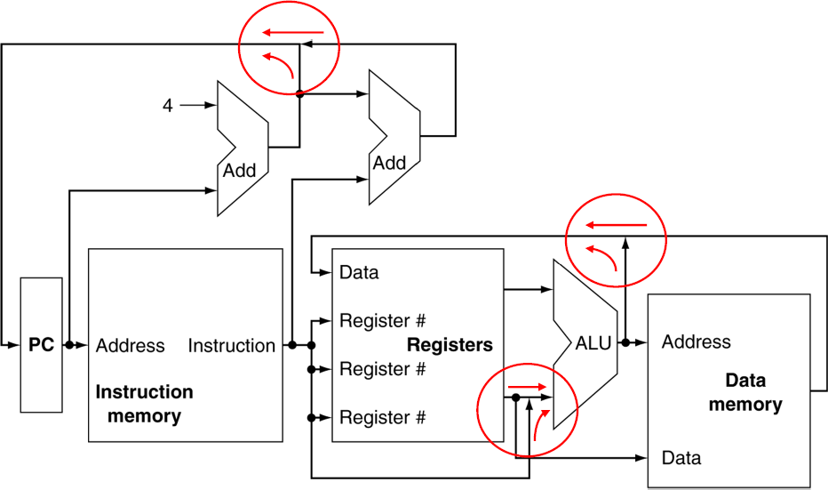
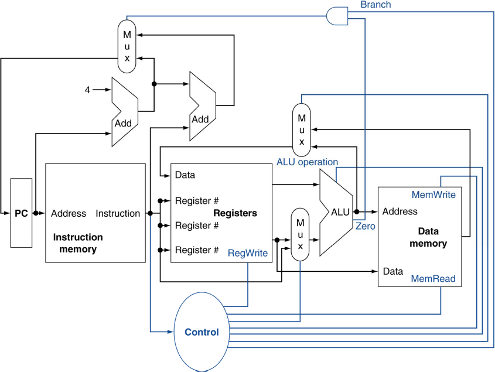

# 4.1. Introduction
## 참고자료
* https://ydeer.tistory.com/143  
* https://velog.io/@adencho/%EC%BB%B4%ED%93%A8%ED%84%B0-%EA%B5%AC%EC%A1%B0-Chapter4  
* [프로세스와 레지스터 (Program Counter, Stack Pointer)](https://velog.io/@wejaan/%EC%9A%B4%EC%98%81%EC%B2%B4%EC%A0%9C-stack-pointer-and-program-counter)

## 1. Introduction

* Clock Cycle(명령 주기): CPU가 명령어를 실행하기 위해 아래의 과정을 수행하는 단계를 말함. 1Hz(헤르츠)는 초당 하나의 명령 수행
    * 데이터를 가져오고(Fetch)
    * 명령어를 해석하고(Decode)
    * 명령어를 실행(Execute)

* 캐시는 CPU가 RAM에서 데이터를 가져오는 동안 CPU에 있는 ALU(계산기)는 놀게 되어 지연이 생기게 되는데, 이를 막고 빨리 명령을 실행하기 위해 CPU안에 내장시키는 저장공간.

* CPU 성능 요소: IC는 ISA(Instructino Set Architecture) & 컴파일러에 의해 결정 | CPI와 cct는 CPU HW에 의해 결정
    * IC(Intruction Count): 실행하는데 필요한 instruction 수
    * CPI(Cycle Per Instruction): 하나의 instruction을 수행하는데 필요한 clock 수
    * cct(Clock Cycle Time): 하나의 Clock Cycle의 길이

* CPU Performance Equation
    ~~~
        CPU Time = IC * CPI * cct
    ~~~
    * Instruction Count, Cycle per Instruction, Clock Cycle Time을 줄이는 것이 CPU 성능을 높이는 것
    * 그러나 이들은 하나를 줄이면 다른 것이 늘어날 수 있는 trade off 관계
    * 예를 들어, clock cycle time을 줄이면 clock cycle의 개수(IC x CPI)가 증가

* MIPS 구현방식을 2가지 형태로 배워볼 것임
    * 간소화 버전
    * 현실적인 pipeline화 버전

* 구현에 실제 MIPS의 모든 명령어를 사용하진 않고 일부분 사용
    * 메모리 참조(memory reference): lw, sw
    * 산술/논리(arithmetic/logical): add, sub, and, or, slt(set less than)
    * 제어 이동(control transfer): beq(branch if equal), j(jump)

## 2. Instruction Execution (Instruction 실행)
* 프로그램이 메모리에 로드되면 instruction들은 instruction 메모리 영역에 순서대로 주소를 가지며 위치함
* PC(Program Counter): 현재 실행하는 명령어의 주소를 가지며(정확히는 다음 명령어 주소를 가리킴)
    * 즉, PC는 **메모리에서 실행할 다음 명령어의 주소를 저장하는 레지스터**
    * Target Address 혹은 PC+4 값이 저장됨
    * Fetch Instruction: PC에 담긴 주소로 instruction 메모리에서 instruction을 읽어오는 것
* 레지스터 번호 <-> 레지스터 뭉치
    * Read register: 명령어에서 레지스터 번호를 통해 레지스터에 접근하여 값을 읽어오는 것

## 3. CPU Overview
### Control이 없는 개략도

* 실제로는 여러 선이 함께 만날 수 없음. 원래는 MUX(Multiplexer)를 사용해 그 중 하나의 신호를 선택
### Control 추가한 개략도

* Control
    * 각각의 HW 모듈(레지스터, 메모리, ...)이 어떻게 동작하는지 제어해주는 컨트롤을 만들어주는 회로
    * 명령어를 읽어서 해당하는 **제어 신호를 만들어냄**

