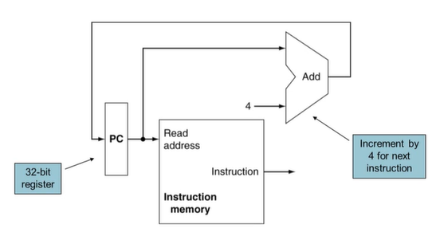

## 참고 자료
* https://youtu.be/udRKoNkZRdQ?si=XDtZSlQG7a5unxkq

## 1. Building a Datapath
* Datapath: 데이터가 흐르는 경로
    * CPU에서 프로세스 데이터와 주소들의 요소가 전달되는 경로
        * 레지스터, ALU, MUX, RAM, ... 등의 모듈들이 연결되는 통로
* MIPS datapath를 순차적으로 만들어볼 것임
    * 개략도의 디자인을 좀 더 개선해볼 것임

## 2. Instruction Fetch
* Instruction 메모리로부터 instruction을 읽음
* PC의 값이 Instruction 메모리에 input으로 들어가면, 해당 instruction이 output으로 출력됨
* 동시에 현재 PC 값에 4를 더한 후 PC에 저장 (PC = PC + 4)

## 3. R-Format Instructions

## 4. Load/Store Instructions

## 5. Branch Instructions 
