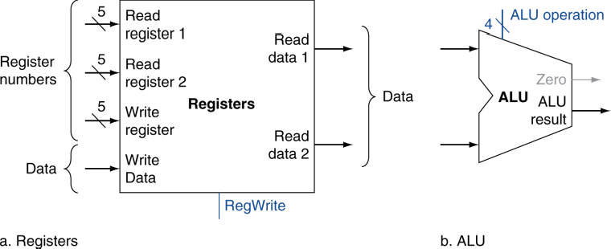
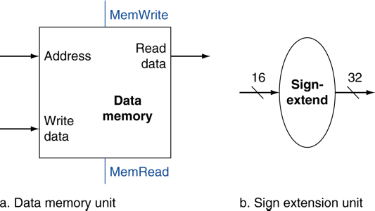

# 4.3. Building a datapath
## 참고 자료
* [유튜브: [컴퓨터구조] MIPS 명령어 데이터패스 처리과정 / R, I, J - Type](https://youtu.be/udRKoNkZRdQ?si=XDtZSlQG7a5unxkq)
* https://blog.naver.com/hyowaii28/221947633176

## 1. Building a Datapath
* Datapath: 데이터가 흐르는 경로
    * CPU에서 프로세스 데이터와 주소들의 요소가 전달되는 경로
        * 레지스터, ALU, MUX, RAM, ... 등의 모듈들이 연결되는 통로
* MIPS datapath를 순차적으로 만들어볼 것임
    * 개략도의 디자인을 좀 더 개선해볼 것임

## 2. Instruction Fetch
* Instruction 메모리로부터 instruction을 읽음
* PC의 값이 Instruction 메모리에 input으로 들어가면, 해당 instruction이 output으로 출력됨
* 동시에 현재 PC 값에 4를 더한 후 PC에 저장 (PC = PC + 4)

### Instructions(R, J, I Format)

## 3. R-Format Instructions

### 명령어 구조
* rs1 = 5bit, first source operand, 
    * 32개의 레지스터가 있기 때문에 5bit를 가짐
    *  주소를 정해야하기 때문
* rs2 = 5bit, secend source operand
* rd = 5bit, destination operand
    * 연산 결과가 저장되는 레지스터를 적어줌
### rs, rt, rd의 Registers 입력 

* op는 Control 유닛에 입력됨
* rs는 Read register 1에 입력됨
* rt는 Read register 2에 입력됨 (Control 유닛의 RegDst 출력이 1)
* rd는 Write register에 입력

### Instruction 수행 결과가 Registers로 향하기까지 과정

* 맨 처음에 PC에서 입력되는 메모리 주소에 해당하는 Instruction을 Instruction 메모리에서 읽어오게 됨
* R 타입 같은 경우 rs와 rt 값으로 계산된 값이 rd(Register 주소값)에 저장되는 것임
* rd(Register 주소값)에 저장해야 하므로 ALU result는 메인메모리를 통과하지 않고 MUX로 향함
    * ALU result로 출력되는 부분에서 ALU 계산 결과 값이 어디로 향할지(캐시 or 메인 메모리) 갈라짐
* Control 유닛에서 MemtoReg에 대한 Select 값을 0으로 설정해주면, Mux로 입력된 값은 Registers의 Write data로 향하게 됨

### PC 업데이트 과정
* PC 값(주소값)은 Add를 거쳐 Mux로 향하게 되는데 Mux의 Select 값은 자연스럽게 0이 됨
    * Control 유닛이 Branch 값을 0을 주면, Mux로 입력될 And 게이트의 출력 값도 0이 됨
* MUX에서 출력되는 PC+4의 값이 PC로 입력되게 됨 (PC = PC+4)

## 4. Load/Store(I-Format) Instructions
### 예시) I-format Load Instruction: lw
* lw(load word) 명령어를 예시로 생각해보자
    * 아래 명령어: $s4주소로부터 12만큼 떨어진 주소에 있는 값을 **$t 레지스터에 저장** (메모리에 있는 값을 레지스터에 저장)
        ~~~
        lw $t1, 12($s4)
        ~~~
        * $s4는 rs에 해당
        * $t1은 rt에 해당
        * 12(Byte offset)는 address에 해당
    * 참고로, sw(stores writes)는 lw와 반대로 동작 (레지스터에 있는 겂을 메모리에 저장)

### rs, rt, rd의 Registers 입력 

* op는 Control 유닛에 입력됨
* rs는 Read register 1에 입력됨
* rt는 **Write register**에 입력됨 (Control 유닛의 RegDst 출력이 0)
* address는 Sign-extend에 입력됨 (address 값이 쪼개지면 의미가 없으며, 뭉탱이로 있어야 유의미)

### Instruction 수행 결과가 Registers로 향하기까지 과정

* 맨 처음에 PC에서 입력되는 메모리 주소에 해당하는 Instruction을 Instruction 메모리에서 읽어오게 됨
* rs는 Registers를 통과하여 rs에 해당하는 값이 ALU로 입력됨
* address는 Sign-extend를 거쳐 32비트로 확장된 주소값이 Mux를 거쳐 ALU로 입력됨
* Control 유닛은 ALUOp 출력을 통해 ALU control에게 어떻게 할지 알려줌 (예시 Instruction의 경우에는 ALU에서 덧셈을 할 것임)
* ALU result 값(연산을 거친 주소값)은 Data Memory에 입력되며, 주소값에 해당하는 값을 Read data로 출력됨
* Read data로 출력된 값은 Mux를 거쳐 Registers의 Write data로 향함

## 5. Branch(J-Format) Instructions

### Instruction 수행 결과가 Registers로 향하기까지 과정

* 맨 처음에 PC에서 입력되는 메모리 주소에 해당하는 Instruction을 Instruction 메모리에서 읽어오게 됨
* address는 Shift left 2 유닛으로 향함
* Shift left 2 유닛에 의해 4를 곱하게 됨
* PC에 4가 더한 값의 MSB(Most Significant Bit, 최상위 비트)인 4 bits와 address에 Shift left 2를 적용한 28 bits가 합쳐져서 32 bits가 됨
* PC의 값은 위에서 합쳐진 새로운 32 bits로 업데이트 됨
* op는 Control 유닛으로 향함
* Control 유닛은 PC를 업데이트 하는 것 외의 요소들은 사용할 필요가 없게끔 신호를 출력