# 4.4. A simple implementation scheme
## 1. ALU(Arithmetic Logical Unit) Control
* ALU는 다음에 쓰임
    * Load / Store: F = add
    * Branch: F = subtract
    * R-type: F는 funct 필드에 따라 달라짐 (Instruction 구조 참고)

|ALU Control|기능|  
|------|---|  
| 0000 |AND|
| 0001 | OR|
| 0010 |add|
| 0110 |subtract|
| 0111 |set-on-less-than|
| 1100 |NOR|

## ALU Control을 얻는 과정
* opcode로부터 2 bits 부분적으로 가져와서 ALUOp로 도출함
* ALUOp로 도출한 이후엔 Combinational logic을 사용하여 ALU Control을 만들어냄  

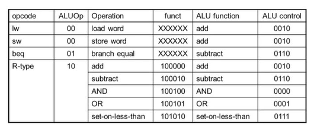

## 2. The Main Control Unit
* Control 신호는 Instruction으로부터 얻어짐(Instruction에 의해 도출됨)
* [31:26]의 opcode 부분은 Control 유닛에 전달되며, R-Format Instruction일 경우에는 funct 필드가 ALU Control 유닛에 전달됨  

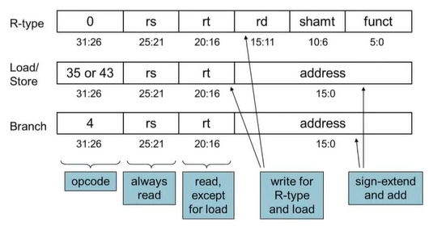

## 3. Datapath with Control
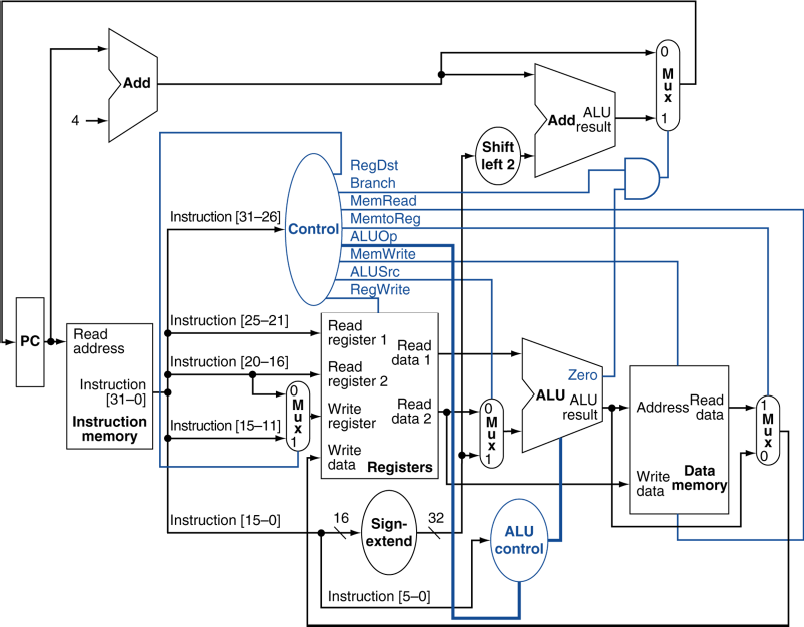

## 4. R-Type Instruction
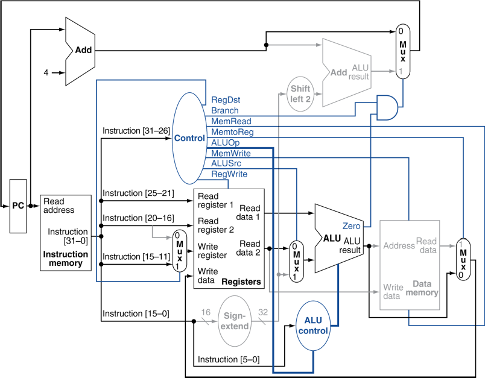
### R-Type Instruction의 Data 및 Control 흐름
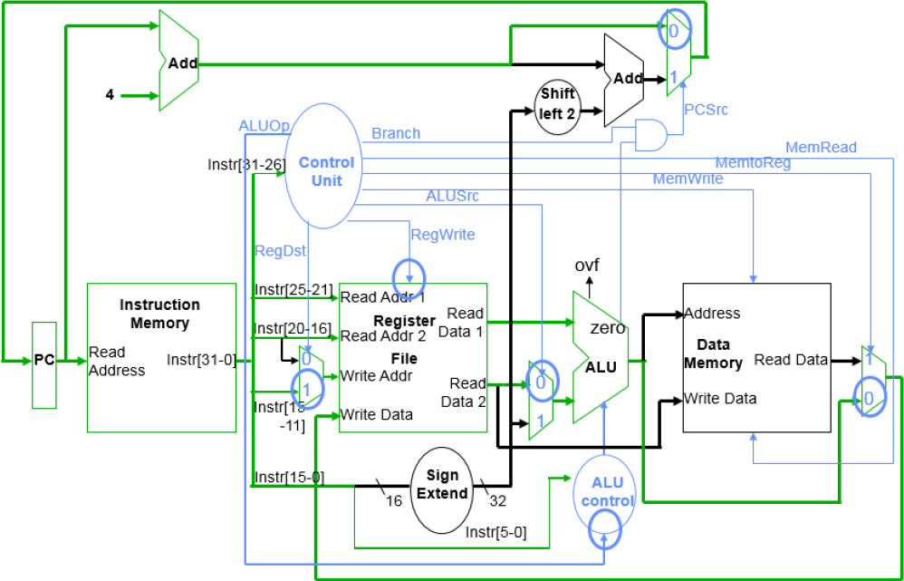

## 5. Load Instruction
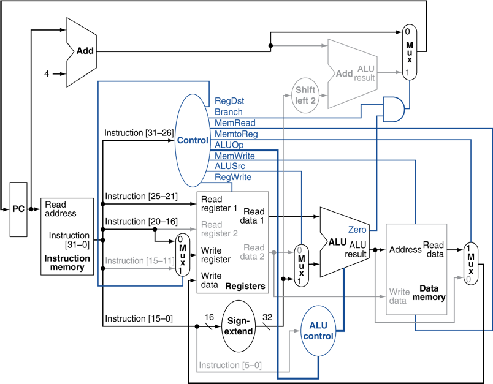  
lw 명령어의 경우, rs 주소로부터 byte offset(address 필드에 해당)만큼 떨어진 주소의 값을 rt 레지스터 주소에 저장하도록 함 
### Load Word Instruction의 Data 및 Control 흐름
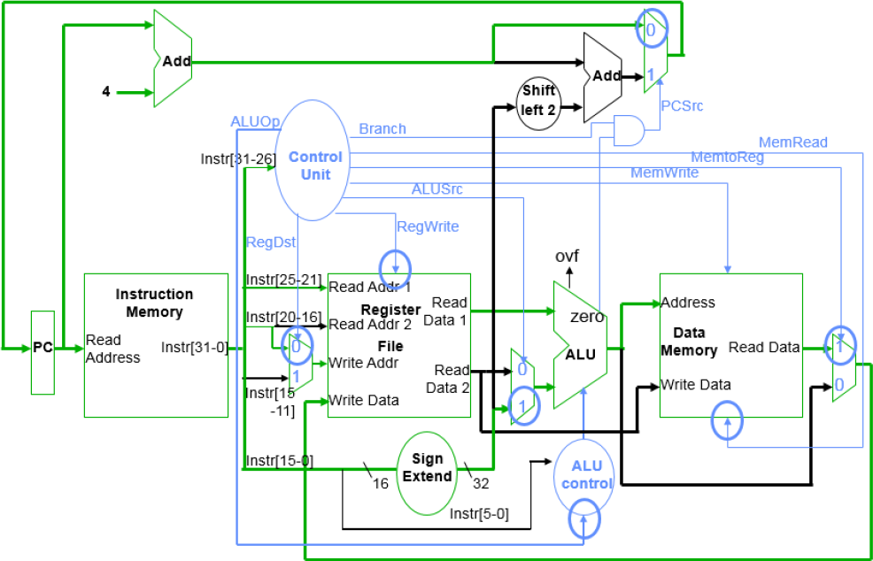

## 6. Branch-on-Equal Instruction
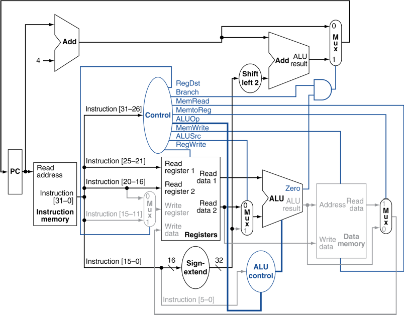

### Branch Instruction의 Data 및 Control 흐름
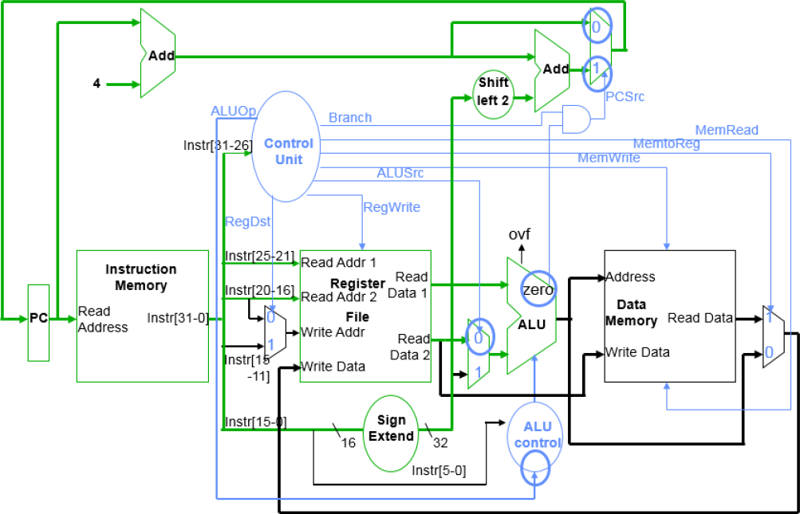

## 7. Implementing Jumps
  
* 직접 주소(word address)를 사용한 Jump
* concatenation(이어붙이기) 방식으로 PC를 업데이트
    * 26 bits의 address
    * 위에 left shift를 2번 수행하여 곱하기 4한 결과를 얻음(크기는 28 bits)
    * 현재 PC의 MSB(상위 4 bits) 뒤에 위에서 곱하기 4한 결과를 합침("old PC" & "address * 4"의 연산, 총 32 bits의 크기)
* opcode로부터 **해석된(Decode) 추가적인 control 신호가 필요**함
### Datapath with Jumps Added
Jump가 추가된 data path는 아래처럼  
* Jump라는 control 신호가 추가됨
* Mux가 추가됨
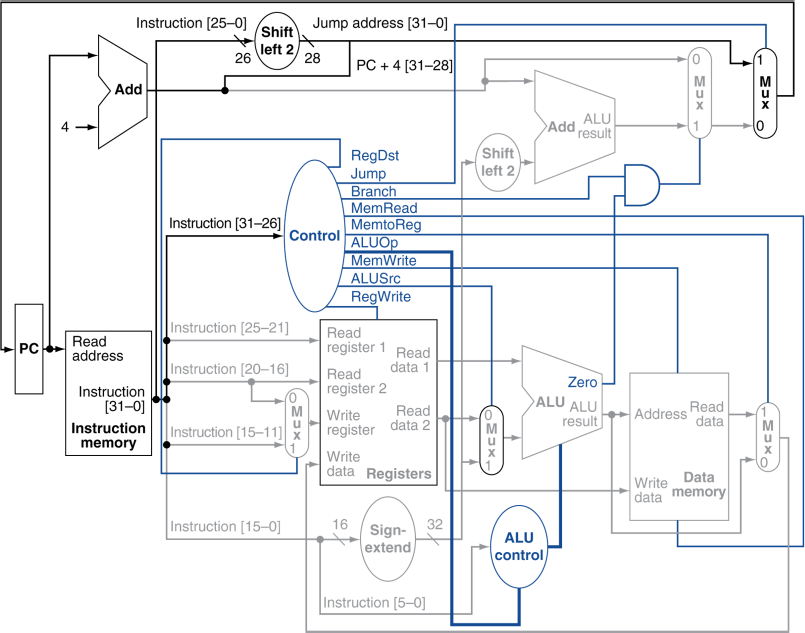
### Adding the Jump Operation
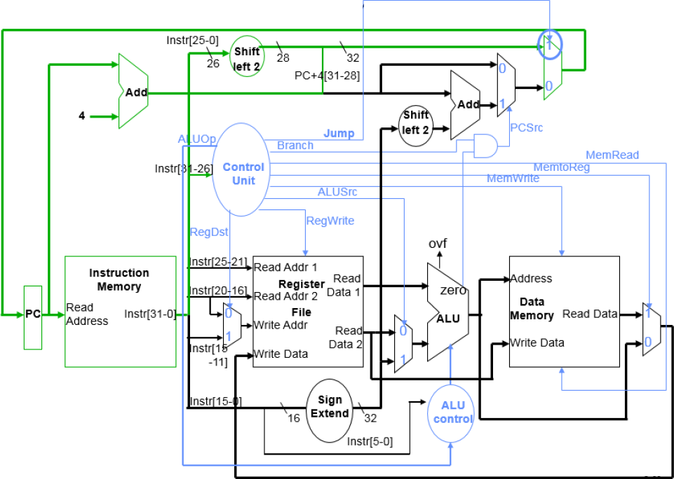

## Performance Issues
* 가장 지연시간이 긴 부분(longest delay) => 전체 클럭 주기 (Clock Period, 하나의 Clock Cycle이 완료되는 데 걸리는 시간)를 결정함  
    * **특히 치명적인 경로는 Load Instruction**  
    * Instruction 메모리 => Registers => ALU => Data 메모리 => Registers  
* **다른 Instruction에 다른 주기로 실행할 수 없음**
    * 모든 Instruction은 하나의 Clock Cycle에 실행되어야 하며, 모두 같은 Clock Cycle Time이어야 함
* 설계 원칙을 위배함
    * 특히 **"가장 일반적으로/자주 사용되는 경로를 빠르게 하라(Making the common case fast)"를 위배**
    * 가장 느린 것에 맞춰지기 때문
    * 자주 사용되는 경로를 빠르게 하려고 해봤자, 가장 느린 것에 맞춰짐
* 따라서 **Pipelining**을 통해 성능을 향상시켜볼 것임
### 왜 다른 Instruction에 다른 주기를 사용할 수 없는가?
1. **동기식 설계의 기본 원칙**:
    * 모든 부품이 같은 클록 신호에 의해 동작하기 때문에, 하나의 Cycle Time으로 동작을 맞춰야 함
    * 클록 주기를 Instruction별로 바꾸는 것은 프로세서를 복잡하게 만들어 설계와 구현이 매우 어렵고 비효율적임
2. **동기화** 문제:
    * 명령어마다 **다른 Cycle Time을 사용하면** 데이터가 흐르는 경로에서 **타이밍 문제**가 발생할 수 있음
    * 예를 들어, Add 명령어가 더 빨리 완료되더라도 Load 명령어를 기다려야 하므로, 실행이 엉키는 문제가 생김