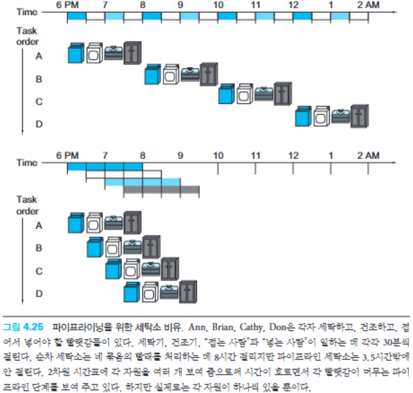
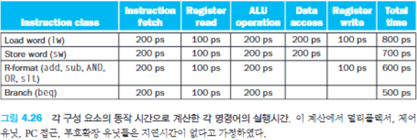
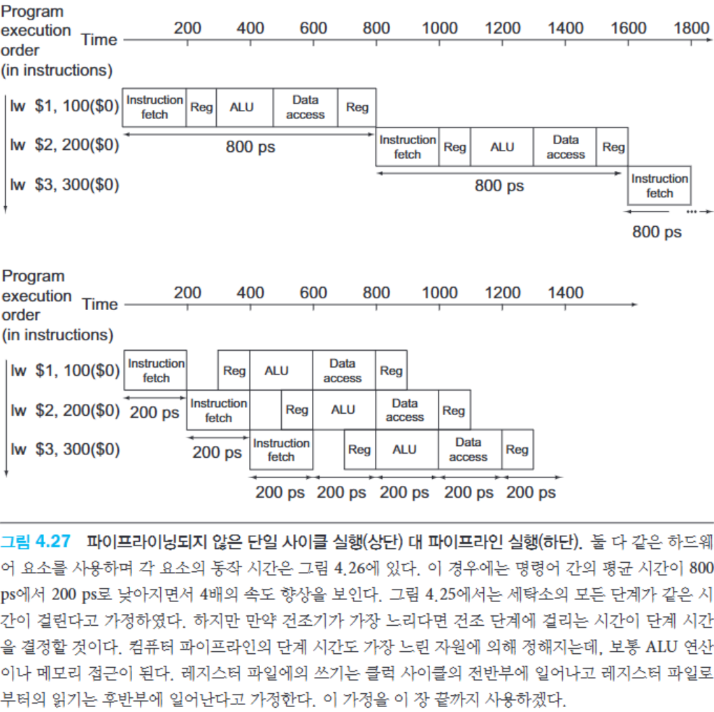
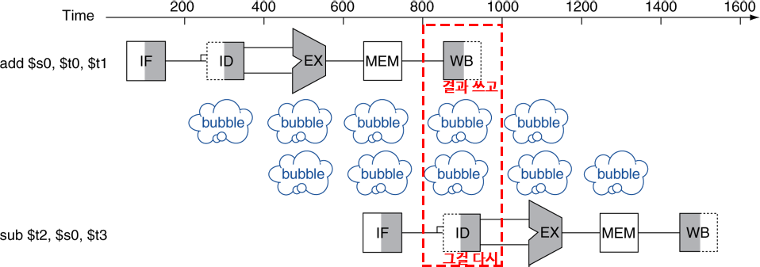
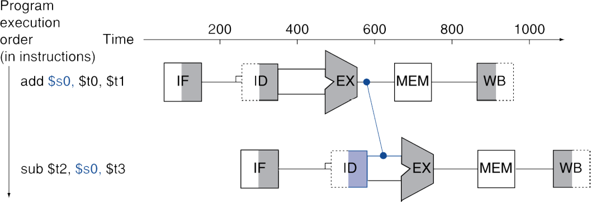
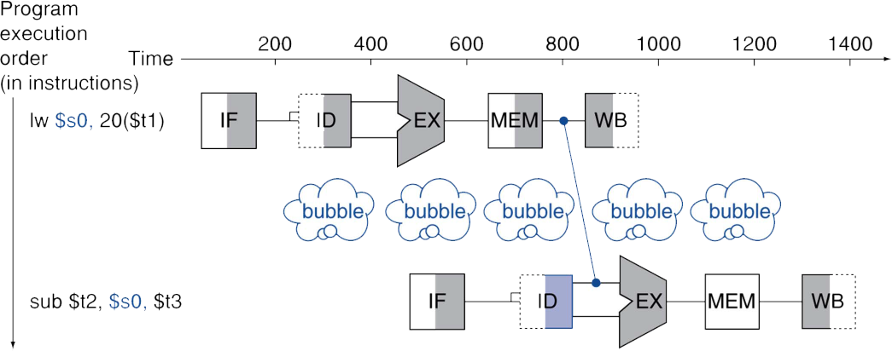
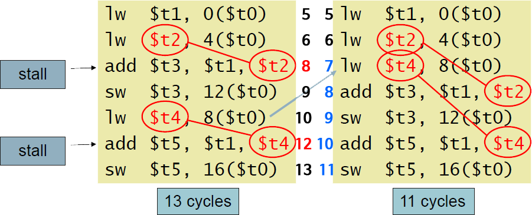
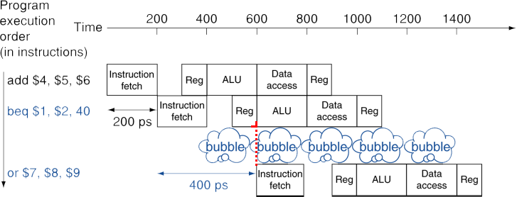
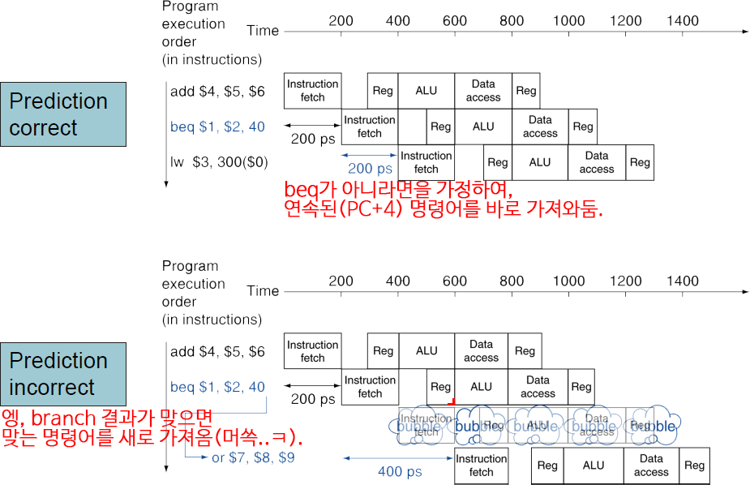

# 4.5. An overview of pipelining
## 1. Pipelining Analogy
Pipelining: 여러 명령어가 중첩되어 실행되는 구현 기술
Pipelining 방법론의 목적: 병렬처리로 성능 향상을 기대하는 것임
만약 **모든 단계(stage)가 거의 같은 시간이 걸리고, 할 일이 충분히 많다면**, 파이프라이닝에 의한 **속도 향상은 파이프라이닝 단계 수(stage 수)와 같음**
### 할 일이 단계 수에 비해 충분하지 않을 경우
* 아래의 그림에서 4배(stage 수)만큼이 아니라 2.3배 빠른 이유: 묶음이 4개밖에 없기 때문임 (즉, 할일이 파이프라인 단계 수에 비해 많지 않을 경우)
* 이렇게 할일이 충분하지 않을 경우에는, 시작 시간과 마무리 시간이 성능에 영향을 미침 

## 2. MIPS Pipeline
### 5개의 Pipeline 단계
1. IF: 메모리로부터 Instruction Fetch (메모리로부터 명령어 로드)
2. ID: Instruction Decode & register read (명령어 해독 & 레지스터 읽기)
3. EX: EXcute operation / calculate address (연산 수행 / 주소 계산)
4. MEM: access MEMory operand (메모리 내부 피연산자에 접근)
5. WB: Write result Back to register (레지스터에 결과를 다시 기록)

## 3. Pipeline Performance
### Pipeline화된 data path에서의 실행 시간과 Single-cycle의 data path에서의 실행 시간 비교

## 4. Pipeline Speedup
* 만약 모든 단계들이 비슷한 처리시간을 갖는다면, '단계 수'배의 성능 향상 기대
* 모든 단계가 균등하지 않다면 속도 향상의 효과는 더 적을 것 => 가장 느린 단계에 맞춰짐
* 속도 향상은 Throughput을 늘려서 얻은 결과 (병렬적으로 Instruction들을 실행)
* 지연 시간(각 Instruction 하나를 실행하는데 소요되는 시간) 자체는 줄어들지 않음

## 5. Pipelining and ISA(Instruction Set Arch) Design
* MIPS ISA는 Pipelining에 적합한 구조
    * 모든 Instruction: 32비트라서 한 Cycle안에 Fetch하고 Decode하기 쉬움
* 적은 종류의 규격화된 Instruction Format
    * 한번에 Decode하고 레지스터를 Read할 수 있음
* Load/Store Addressing
    * 주소 계산은 3번째 단계에서, 메모리 접근은 4번째 단계에서 이루어짐 (위의 Pipeline 5단계 참고)
    * 즉, 단계별로 다른 작업을 수행
* Memory Operand의 정렬
    * Memory Access는 한 Cycle 안에 이루어짐

## 6. Hazards
* Hazard란?: 다음 Instruction이 다음 Clock Cycle에 실행될 수 없는 상황
    * 즉, 매 Cycle마다 Instruction을 실행해야 하는데, 그렇지 못하는 경우

### 3가지 종류의 Hazards
#### 1. Structure Hazard(구조적 Hazard)
* 정의: **Instruction을 수행하기 위해 필요한 HW 자원이 사용중인 경우**
* 예시: 단일 메모리를 사용하는 MIPS 파이프라인에서
    * Load/Store 명령은 데이터 접근을 위해 메모리에 접근
    * 그런데, Instruction Fetch도 Instruction을 가져오기 위해 메모리에 접근
    * 두가지가 동시에 진행 불가능, 한쪽은 대기하고 해당 Cycle을 지연시킴
* 해결 방안
    * 따라서, Pipeline화된 Datapath는 **Instruction Memory와 Data Memory가 분리**되어야 함
    * 혹은, **Instruction과 Data Cache를 분리**
* 대부분의 Structure Hazard는 자원 부족으로 인해 발생하며, 일반적으로 자원을 추가하면 해결됨

#### 2. Data Hazard(데이터 Hazard)
* 정의: **명령어를 실행하는 데 필요한 데이터가 아직 준비되지 않아** 계획된 명령어가 적절한 Clock Cycle에 실행될 수 없는 경우
* 예시: Instruction을 수행하기 위해 필요한 데이터가 있는데, **다른 Instruction이 데이터를 Read/Write하고 있는 경우**
* 해결 방안
    * **Forwarding**(전방 전달, Bypassing): 별도의 HW를 추가하여 정상적으로는 얻을 수 없는 값을 내부 자원으로부터 일찍 받아오는 것 (교재의 p318~319)
        * 그러나 예외적으로 적재-사용 Data Hazard(Load-Use Data Hazard)의 경우에는 Forwarding을 해도 한 단계 버블(지연)이 일어난다.
        * 교재 p320 문제 풀어보기

#### 3. Control Hazard(제어 Hazard)
* 정의: 어떤 Instruction 수행이 **다른 Instruction 결과에 의존하는 경우**, 제어 행동을 결정하는 것이 이전 Instruction에 의존하는 경우
* 해결 방안
    * 지연: 동작하는 것은 확실하지만 느림
    * 예측: Instruction 결과 예측이 틀린다면 다시 수행해야한다는 위험
        * 대부분의 컴퓨터가 분기 명령어를 다루기 위해 **예측**을 사용함
    * **지연 결정**: 분기 명령어에 의해 영향받지 않는 명령어를 지연 분기 명령어 바로 다음에 옮겨 놓으며, 분기 명령어는 이 안전한 명령어 이동을 고려하여 분기 주소를 변경
        * 분기 명령어가 실행되면, 프로세서는 분기된 **목적 주소(Target)로** 이동해야 하지만, 지연 슬롯에 넣은 명령어를 먼저 실행해야 함
        * 이를 위해 **분기 주소(Target)를** 원래 목표 주소보다 한 단계 뒤로 조정

## 7. Structure Hazards
* 하드웨어 자원을 이용하는 것에서 충돌
* 단일 메모리를 사용하는 MIPS Pipeline에서
    * Load/Store 명령은 data 접근을 위해 메모리에 접근
    * IF(Instruction Fetch)도 Instruction을 가져오기 위해 메모리에 접근
    * 동시에 진행될 수 없으므로 파이프라인에 Bubble을 가져올 수 있음
* 해결책
    * Pipeline화된 Datapath는 Instruction 메모리와 Data 메모리가 분리되어야 함
    * 혹은 Instruction과 Data Cache를 분리해야 함

## 8. Data Hazards
* Instruction은 다른 Instruction이 데이터에 접근하는 것이 완전히 끝나는 것에 의존적 (해당 데이터가 사용 중이면, 대기해야 함)
    ~~~
    add　$s0, $t0, $t1
    sub　$t2, $s0, $t3
    ~~~
    
* 해결책
    * Stalling
    * nop(아무것도 안하는) Instructions 삽입 (Stall과 유사)
    * Forwarding (HW적으로 통로를 만들어 당겨쓰기)
    * Code Scheduling ()

### Data Hazards --- Forwarding (aka Bypassing)
* 계산된 직후의 결과를 바로 사용(레지스터에 저장되기 전에 곧바로)
    * 레지스터에 write back되는 것을 기다리지 않음(store까지 기다리지 않음)
    * Datapath에 추가적인 연결이 필요하다
    

### Data Hazards --- Fowarding --- Load-Use Data Hazard (적재-사용)
* 항상 forwarding(aka bypadding)으로 모든 Stall을 피할 수는 없을 수 있음
    * 결과가 필요한 순간에 아직 계산이 완료되지 않았다면,
    * 제 때에 값을 끌어올 수도 없이 "존재하지도 않는다면" 활용도 불가능
    * 예를 들어 아래 그림에서 lw　$s0, 20($t1) 명령어의 경우,
        
        ~~~
        EX 단계에서: 20($t1)의 주소를 ALU에서 계산,(이건 수행했음)
        MEM 단계에서: 그 주소를 토대로 MEM에 접근,(이제 접근 중이라 값을 다 못 가져옴)
        그 곳의 값을 sub 명령의 $s0에 load.
         
        어쨌든 최대한 줄이려고 해도(레지스터에 write back 전에 빼오려고 해도),
        MEM에 접근 이후에나 원하는 값을 알 수 있음.
        최대한 줄여도 결국 1 Cycle의 Stall이 발생.
        ~~~

### Data Hazards --- Code Scheduling to Avoid Stalls

* Forwarding은 극한적으로 값의 생성 시점에 집중하여 값을 당겨온 것이었음 (추가적인 HW 통로를 만들어서라도)
    * 이 방법은 "값 때문에 대기할거면 다른 일을 미리 해두면 되지"의 방식

* Code Scheduling으로 Stall을 피할 수 있음
    * 코드의 순서를 바꿈으로써, 다음 Instruction에 필요한 결과값 Load 과정에서 발생할 Stall을 회피

#### Example
아래의 C언어 코드가 주어졌을 때, A의 기본 주소는 $t0에 저장된다고 가정
~~~
A[3] = A[0] + A[1];
A[4] = A[0] + A[2];
~~~

* Data Dependency로 **Stall이 발생하는 순서에서 Independent한 명령어끼리 연속되도록** 해서 Stall을 없앰
    * 왼쪽 코드에서, `add $t3, $t1, $t2`에서 $t2의 값을 알려면, 4($t0) 때문에 (MEM 직후까지) Forwarding을 해도, 1개 Stall 발생
    * 왼쪽 코드에서, `add $t5, $t1, $t4`에서 $t4의 값을 알려면, 8($t0) 때문에 (MEM 직후까지) Forwarding을 해도, 1개 Stall 발생
    * 첫번째 Stall 부분에 `lw $t4, 8($t0)`를 당겨와서(그동안 이 명령어에 이용되는 값은 변하지 않았으니) 미리 수행해둠 (바로 위의 명령어와 Independent하여 바로 가능)
    * $t4를 미리 준비해놔서, 두번째 Stall도 같이 사라짐
        * 코드의 양을 줄이는 것이 아닌, 수행 순서를 바꾸는 것

* **데이터 의존성**(Data Dependency)는 **RAW, WAW, WAR의 3가지 경우가 존재**
    * **직전의 결과와 상관이 있을 때, Stall이 발생하는 Data Hazard**는 **RAW(Read After Write)에서 발생**
    * RAW에서 발생하는 Stall:
        * 읽기(Read) 작업이 쓰기(Write) 작업보다 먼저 실행되면 데이터가 틀려질 수 있음
        * 이 때문에 파이프라인이 잠시 멈추는(정지: stall) 현상이 발생
    * WAW와 WAR:
        * WAW와 WAR의 경우, 멀티쓰레드에서 동기화 문제와 비슷함
        * 데이터를 동시에 여러 명령어가 처리하면, 쓰기 순서가 틀어져서 결과가 달라질 수 있음
        * 병렬 구조에서는 이런 상황을 방지하기 위해 쓰기 순서를 제대로 관리해야 함

## 9. Control Hazards
* Control Hazard는 제어 신호(branch)로 인해 프로그램의 flow가 바뀔 수 있는 상황에서, flow가 바뀔지도 모르기 때문에 직후 명령어들이 바로 실행되지 못하는 Hazard
* 분기(branch)는 Control의 흐름을 결정
    * 다음 명령어를 가져오는 것(IF, Instruction Fetch)는 분기의 결과(Branch Outcome)에 의존적
        * Ex. 순차적으로 PC+4가 될지, beq 최종신호로 1이 와서 다음 주소 결과를 PC에 담을지
    * Pipeline은 항상 올바른 Instruction을 Fetch하지 않을 수 있음
        * Branch의 ID(Instruction Decode & Register Read) Stage가 여전히 작업 중(즉, Branch 조건을 검사 중)이라 결과를 못 내고 있을 때
* 해결책: MIPS pipeline에서
    * **분기 예측(Branch Prediction)**: Branch 명령어의 비교대상(레지스터 값)을 비교하는 것과 Jump 대상 주소 계산을 **미리** 해야 함
    * 그럴 수 있도록 ID(Instruction Decode) Stage에 HW를 추가

### Control Hazards --- Stall on Branch
* Branch에서의 Stall: 다음 Instruction을 Fetch하기 전에, Brach 결과가 결정되기를 기다리는 상황

* ID(Instruction Decode) Stage(분기 조건 검사 단계)에 HW를 추가하여 미리 비교를 하고 주소를 계산했더라도, ID Stage가 끝나야 알 수 있으므로, 1 Cycle Stall

### Control Hazards --- Branch Prediction
* 해결책으로 Branch 결과를 예측
    * 긴(Stage 수가 많거나 긴) Pipeline에서는 이전의 Branch 결과가 결정되는 것을 기다릴 수 없음
        * Stall로 인한 불이익이 커질 수 있음
    * Branch 결과를 예측
        * 만약 예측이 틀렸을 경우에만 Stall이 발생
    * **가장 단순한 예측** 방법으로는 MIPS Pipeline에서,
        * Branch 결과를 **일어나지 않은 것으로 예측(가정)할 수 있음** (MIPS with Predict Not Taken)
            * Branch 명령어 이후에 Instruction Fetch를 지연없이 바로 수행 가능

### Control Hazards --- Branch Prediction --- MIPS with Predict Not Taken
* MIPS에서, 일어나지 않은(분기 조건에 만족하지 않는) 순차적인 흐름(PC+4)으로 예측

### Control Hazards --- Branch Prediction --- 좀 더 현실적인 Branch Prediction
실제로 사용하는 것에 가까운 방식의 예측들임  
* Static Branch Prediction
    * 전형적인(Typical) branch 동작에 기인함(Based on)
    * 정확도는 떨어질 수 있음
    * 예시: loop와 if문 branch
        * 위로 되돌아가는(backward) branch는 일어날 것으로 예상(가정)하고, 해당 주소의 Instruction Fetch
        * 아래로 진행하는(forward) branch는 일어나지 않을 것으로 예상(가정)하고, PC+4의 Instruction Fetch
* Dynamic Branch Prediction
    * HW가 실제의(actual) branch 동작을 측정
        * 각 branch의 최근 history를 기록
    * 미래의 동작은 그동안의 **경향(Trend)을 따를 것**으로 가정
        * 그게 틀린다면, Stall이 발생하고 Re-Fetching이 일어날 것임
        * History는 잘되든 못되든 기록되며, Stall이 발생하면 점차 **경향(Trend)도 변할 것**임
    * 정확도는 높아지지만, History 기록과 Trend 측정에 자원 소요
        * 최신 프로세서는 이 방식을 사용

## 10. Pipeline Summary
* Pipelining은 **Instruction의 Throughput(명령어의 양양)을 늘림으로써 성능을 향상시키는 방법**
    * 한 명령어의 실행 속도가 아닌, 동시에 여러 명령을 가능하게 하는 양을 늘린 것
    * 병렬적으로 여러 명령을 실행
    * 각 Instruction은 같은 지연시간을 가짐
* Hazard 정의: 다음 Cycle에 다음 명령어가 시작되는 것을 막는 상황
* Hazard에 주의해야 함
    * Structure Hazard (필요한 HW 자원이 사용중)
    * Data Hazard (필요한 데이터 준비 안됨)
    * Control Hazard (다른 Instruction 특히, branch 결과에 의존)
* Instruction Set의 설계 방식은 Pipeline 구현의 복잡도에 영향을 미침
    * ISA(Instruction Set Architecture) 복잡도 => Pipeline 구현 복잡도