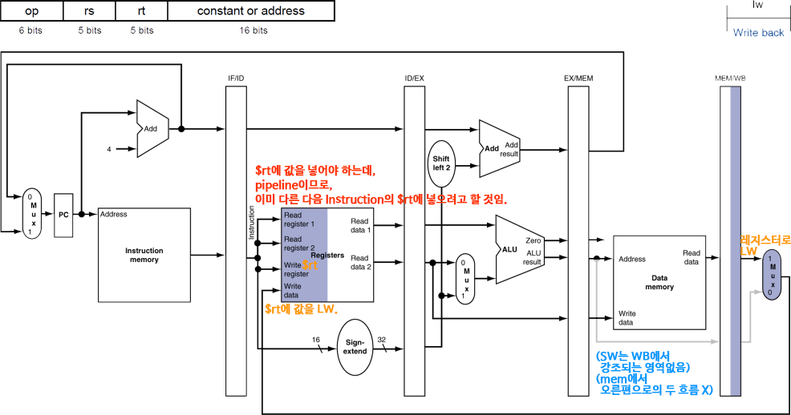

# 4.6. Pipelined datapath and control.md
## 1. MIPS Pipelined Datapath
예전에 본 개략도는 single-cycle이고, 이제는 muilti-cycle(Pipelined) 개략도

* RECAP: 명령어 실행 5 단계
    * IF: 명령어 인출
    * ID: 명령어 해독 및 레지스터 파일 읽기
    * EX: 실행 또는 주소 계산
    * MEM: 데이터 메모리 접근
    * WB: 쓰기(Write-back)
* 오른쪽에서 왼쪽으로 가는 연결이 Hazard를 일으킴
    * 첫 번째 연결은 Data Hazard
    * 두 번째 연결은 Control Hazard
## 2. Pipeline Registers
* 각 Stage 사이에 레지스터들(`Stage 수 - 1` 개)이 필요
    * 레지스터들이 필요한 **이유**: **이전 Cycle에서 만들어진 정보를 가지고 있어야 하기 때문임**
        * IM(Instruction MEM)은 명령어의 다섯 단계 중 한 단계에서만 사용됨, 다른 네 단계 동안에도 각 명령어의 값을 유지해야 함

## 3. Pipeline Operation
Load, Store 명령어 동작에 대한 pipelined datapath 다이어그램을 살펴볼 것임
* Load: MEM => Register
    * ex. `lw`, load word
* Store: Register => MEM
    * ex. `sw`, store word
### Single-clock-cycle pipeline diagram --- IF(Instruction Fetch) for Load, Store, ...

* PC에 있는 주소를 사용하여 Instructino MEM에서 명령어를 읽어오고, IF/ID 파이프라인 레지스터에 저장하는 것을 보여줌
* PC 주소는 4만큼 증가되어 PC에 다시 저장됨으로 다음 Clock Cycle에 사용 가능
* **이 증가한 주소는** beq 같은 명령어가 나중에 사용할 수 있기 때문에 **IF/ID 파이프라인 레지스터에도 저장됨**
#### 정리하자면, IF/ID 파이프라인 레지스터의 역할은 ...
IF/ID 파이프라인 레지스터는 다음 단계를 위해 중요한 데이터를 저장함
**IF 단계에서는 다음 두 가지 정보를 담음**:

1. **PC + 4 값**:
    * 다음 명령어 주소를 계산한 값
    * 이 값은 분기 명령어와 같은 경우에 유용하게 사용(분기 예측 실패 시 복구 등)
2. **Fetch된 명령어(Instruction)**:
    * 현재 명령어를 해석(Decode)하기 위해 저장
    * 이 명령어는 이후 ID(Instruction Decode) 단계에서 해석되어 사용됨

### Single-clock-cycle pipeline diagram --- ID(Instruction Decode & Register Read) for Load, Store, ...

* IF/ID 파이프라인 레지스터의 명령어 부분이 16비트 수치 필드(32비트 확장됨) 값과 레지스터 번호 2개를 제공하는 것을 보여줌
* **세 값(Sign-Extended 값과 레지스터 번호 2개) 모두 증가한 PC 주소 값과 더불어 ID/EX 파이프라인 레지스터에 저장됨**
    * 참고로, lw 명령어는 `$rs`로부터 `address`만큼 떨어진 주소의 값을 MEM에서 읽어와 Register의 `$rt`에 쓰는 것임

### Single-clock-cycle pipeline diagram --- EX(EXcute operation / calculate address) for Load, Store, ...

* 적재(load) 명령어가 ID/EX 파이프라인 레지스터에서 Register 1의 내용(`$rs`의 값)과 Sign-Extended 수치(address) 필드를 읽고, ALU를 사용하여 이 둘을 더하는 것을 보여줌
* **합한 결과(`ALU result`)는 EX/MEM 파이프라인 레지스터에 저장됨**
* **Store Word의 경우**, Load Word와는 달리 **두번째 레지스터 값이 EX/MEM 파이프라인 레지스터에 저장됨**

### Single-clock-cycle pipeline diagram --- MEM(MEMory access) for Load, Store, ...
* MEM for Load (MEM => Register)
    
    * 적재 명령어가 EX/MEM 파이프라인 레지스터에서 ALU 계산을 거친 주소를 받아 Data MEM을 읽고 이 데이터(`Read data`)를 MEM/WB 파이프라인 레지스터에 저장하는 것을 보여줌

* MEM for Store (Register => MEM)
    
    * 적재 명령어가 EX/MEM 파이프라인 레지스터에서 ALU 계산을 거친 주소에 레지스터 값(`Write data`)을 저장함

### Single-clock-cycle pipeline diagram --- WB(Write-Back) for Load

* MEM/WB 파이프라인 레지스터에서 읽은 데이터를 datapath 가운데에 있는 레지스터 파일에 쓰는 것을 보여줌
* Store Word 명령어의 경우에는 WB(Write-Back) Stage에서 강조되는 영역이 없음
    * 메모리에서 오른편으로 흐르는 두 개의 흐름(I-Format의 Load Word용 값 / R-Format의 결과값)이 없음
    * 따라서, Store Word의 WB(Write-Back) Stage는 아무 작업도 없다는 점
* 중요한 것은... 사실 이 설계에는 버그가 있음!! => 바로 아래 섹션에서 소개

### Single-clock-cycle pipeline diagram --- Corrected Datapath for Load (설계상의 버그 수정)

* 문제점: Write register에 입력되는 `$rt` 정보가 파이프라인 레지스터에 유지되지 않아 소실된다는 점
* `$rt` 보존을 위해, Register 이후의 Stage간 파이프라인 레지스터마다 `$rt`를 넘겨줌으로써, WB(Write-Back)에서 다시 레지스터에 전달하여 활용

## 4. Multi-Cycle Pipeline Diagram
~~~
lw $10, $20($1)
sub $11, $2, $3
add $12, $3, $4
lw $13, 24($1)
add $14, $5, $6
~~~

* 시간과 명령어에 따른 리소스(HW Resource) 사용을 보여줌
    

* 전통적인 형태(Traditional Form)의 다이어그램
    

## 5. Single-Cycle Pipeline Diagram

* 주어진 Cycle(특정 Cycle)에서 Pipeline의 상태를 보여줌
    * 각 Stage들이 어떤 명령어를 수행하고 있는지
    * 위의 Multi-Cycle Pipeline Diagram에서 CC5에 해당하는 시점의 Pipeline 상태
## 6. Pipelined Control (Simplified Version Diagram) --- Control 유닛의 영향을 받는 datapath 추가

## 7. Pipelined Control

* Control Signal(Control 신호)는 Instruction으로부터 파생됨 (Single-Cycle에서처럼)

* 각 Stage에 Control 신호들이 전달되기 위해 파이프라인 레지스터(Pipeline Register)에 함께 전달되며 유지(보존)되어야 함
    * Pipeline 구조에서는 ID에서 또 새로운 명령어로 다른 제어신호들이 생성되기 때문에,
    * Single-Cycle과는 달리, ID에서 해석되어 생성된 제어신호들이 각 Stage에 쓰이기 위해 보존되어야 함

## 8. 복습하기
* Q: Pipeline Processor에서 **Forwarding의 정의**는?
    * A: **Data Hazards** 해결을 위해, 값이 계산되자마자 HW를 통해 **곧장 끌어다 쓰는 것**
    * 중요한 점: Forwarding은 **대부분의 Data Hazards를 해결할 수 있으나, Load-Use Data Hazard는 해결할 수 없음** (읽지를 않아 값이 존재하지도 않기 때문)
* Q: Forwarding으로는 Load-Use Data Hazard를 해결할 수 없다. 그렇다면, **Load-Use Data Hazard를 해결할 수 있는 해결책**은?
    * A: **Code-Scheduling** 방법으로 Stall을 피할 수 있음 (**명령어의 순서를 조정하여 종속성으로 인한 Stall 발생을 방지**)