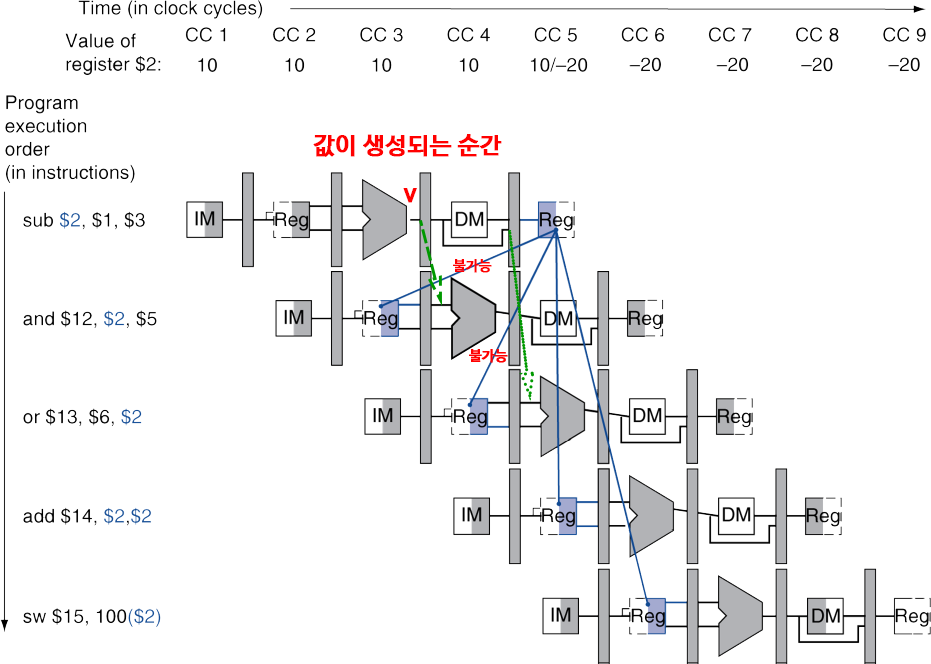
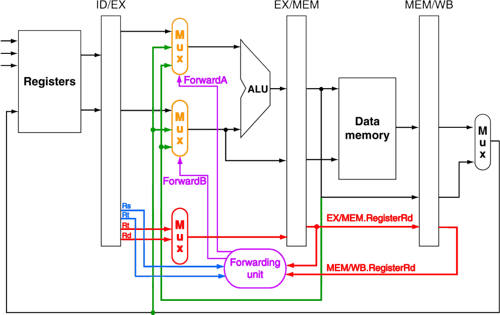
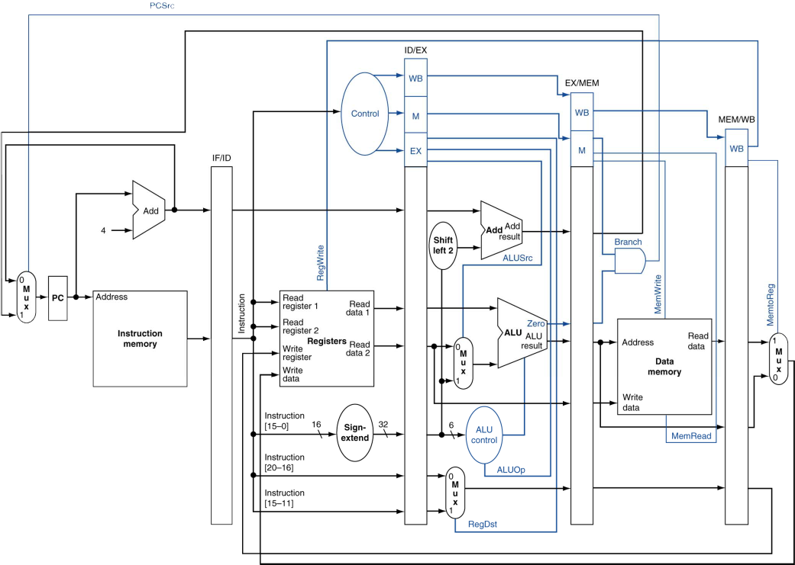
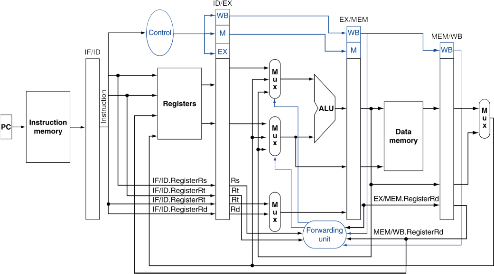
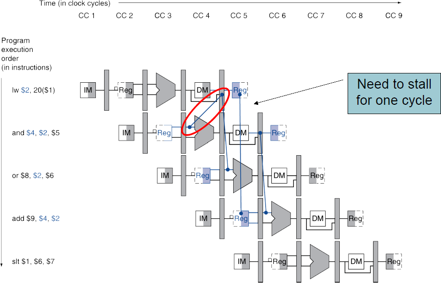
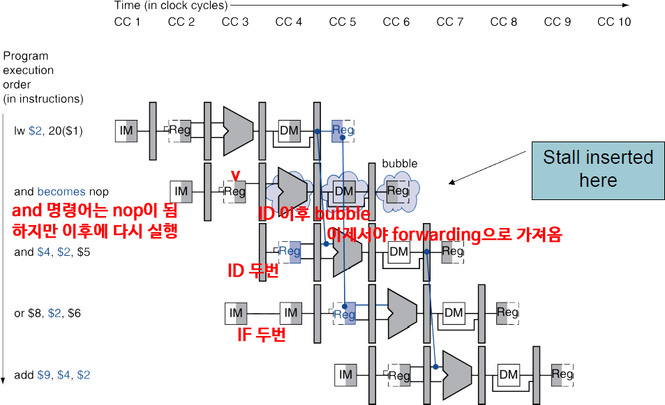
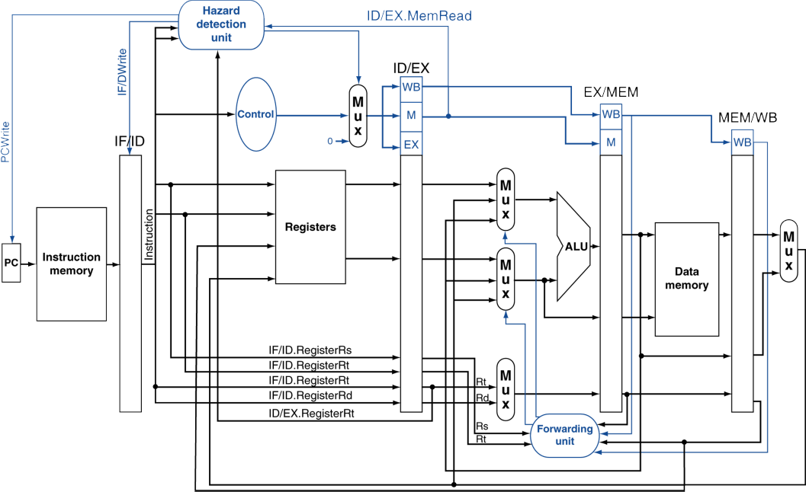

# 4.7. Data hazards: Forwarding vs Stalling
## 1. Data Hazards in ALU Instructions
다음 순서의 Instructions를 살펴보자  
　sub　**$2**, $1, $3  
　and　$12, **$2**, $5  
　or 　 $13, $6, **$2**  
　add　$14, **$2**, **$2**  
　sw 　 $15, 100(**$2**)  
  
* 우리는 Forwarding(bypassing)으로 Data Hazard를 해결할 수 있음
    * 그러면 Forwarding이 필요한 때는 어떻게 알 수 있는가(detect)?

## 2. Data Dependencies & Forwarding

### RECAP: Data Dependency (4.5. An Overview of Pipelining으로 돌아가서)
* 데이터 의존성(Data Dependency)는 **RAW, WAW, WAR의 3가지 경우가 존재**
    * 직전의 결과와 상관이 있을 때, Stall이 발생하는 Data Hazard는 RAW(Read After Write)에서 발생
    * **RAW에서 발생하는 Stall**:
        * **읽기(Read) 작업이 쓰기(Write) 작업보다 먼저 실행되면 데이터가 틀려질 수 있음**
        * 이 때문에 파이프라인이 잠시 멈추는(정지: stall) 현상이 발생
    * WAW와 WAR:
        * WAW와 WAR의 경우, 멀티쓰레드에서 동기화 문제와 비슷함
        * 데이터를 동시에 여러 명령어가 처리하면, 쓰기 순서가 틀어져서 결과가 달라질 수 있음
        * 병렬 구조에서는 이런 상황을 방지하기 위해 쓰기 순서를 제대로 관리해야 함

### Forwarding은 RAW만 해결할 수 있음
* 우리가 관심있는 Dependency는 RAW에 의한 의존성
    * WAW, WAR의 데이터 의존성은 Forwarding으로는 해결하지 못함
    * 즉, **Forwarding은 RAW 데이터 의존성만을 해결 가능함**
    * WAW와 WAR은 병렬식으로 누가 먼저 써버리느냐에 따라 결과가 달라질 수 있음 (병렬성에 민감한 문제)

* 위 그림에서 $2 값을 위주로 살펴보자
    * 다음 cycle 기준으로는 EX/MEM 레지스터가 생성된 값을 가지고 있고(해당 명령어는 MEM단계로 들어갔으니),
    * 다다음 cycle 기준으로는 EX/MEM 레지스터에는 이미 다른 값으로 덮혔지만,
    * MEM/WB 레지스터에 해당 값을 가지고 있음(해당 명령어는 WB단계로 들어갔으니)

## 3. Detecting the Need to Forward (Forwarding이 필요한 순간 감지)
* Pipeline을 통해 레지스터 번호를 넘겨준다(pass).
    * e.g., **ID/EX.RegisterRs**: ID/EX pipeline register의 **Rs(SourceRegister)를 위한** 레지스터 번호
* EX stage에서의 ALU 피연산자 레지스터 번호는 다음과 같음(R-format의 ALU)
    * `ID/EX.RegisterRs`, `ID/EX.RegisterRt` (Rs와 Rt)
### Data Hazard가 발생하는 4가지 경우
~~~
1. Fwd from EX/MEM Pipeline Register (EX 기준 2 Cycle 전에서의 Rd)
    1a. EX/MEM.RegisterRd = ID/EX.RegisterRs
    1b. EX/MEM.RegisterRd = ID/EX.RegisterRt
2. Fwd from MEM/WB Pipeline Register (EX 기준 1 Cycle 전에서의 Rd)
    2a. MEM/WB.RegisterRd = ID/EX.RegisterRs
    2b. MEM/WB.RegisterRd = ID/EX.RegisterRt
~~~
* 1a, 1b는 다음 Cycle Instruction의 EX의 피연산자들(`ID/EX.Register의 Rs / Rt`)이 이전 Cycle Instruction의 MEM의 Rd(`EX/MEM.RegisterRd`)와 같을 경우를 말함
    * 즉, WB를 위한 대상 레지스터에 값이 쓰이고, 다른 명령어가 그 값을 읽어야하는데, 아직 값이 쓰이지 않아서
    * 1 Cycle 전의 Instruction에서, EX 직후에서 "계산된 Rd에 쓰일 값"을 끌어와 사용
* 2a, 2b는 다음 Cycle Instruction의 EX의 피연산자들(`ID/EX.Register의 Rs / Rt`)이 이전 Cycle Instruction의 WB의 Rd(`MEM/WB.RegisterRd`)와 같을 경우를 말함
    * 즉, WB를 위한 대상 레지스터에 값이 쓰이고, 다른 명령어가 그 값을 읽어야하는데, 아직 값이 쓰이지 않아서
    * 2 Cycle 전의 Instruction에서, MEM 직후에서 "Rd에 쓰일 값이 흐르던 것"을 끌어와 사용

### Forwarding이 이루어질 경우의 Control Signal과 Pipeline Register Rd
* Forwarding은 이전의 Instruction에서 레지스터에 값이 쓰여지지 않는 것들을 해결하는 것 (늦게 쓰여져서)
    * Pipeline Register에 함께 전해지는 Control Signal을 살펴보면, RegWrite 신호를 찾아볼 수 있음
        * EX/MEM.RegWrite, MEM/WB.RegWrite
* Write 대상이므로, Write 대상 레지스터 번호를 나타낼 Rd도 $zero가 아닐 것임 (0번 레지스터에는 Write 불가능)
    * `EX/MEM.RegisterRd` $\neq 0$
    * `MEM/WB.RegisterRd` $\neq 0$

### Forwarding의 핵심 원리
1. 현재 EX 단계의 명령어는 피연산자(Operands)를 필요로 함 (`ID/EX.RegisterRs`, `ID/EX.RegisterRt`)
2. 이전 명령어가 이미 결과를 연산했지만 아직 WB(Write Back) 단계에서 저장하지 않았다면,
**EX/MEM 단계나 MEM/WB 단계에서 Forwarding을 통해 직접 값을 전달할 수 있음**
3. Forwarding 조건을 확인하는 Forwarding Unit이 **EX/MEM 단계 또는 MEM/WB 단계의 목적 레지스터(RegisterRd)가 현재 명령어의 소스 레지스터(RegisterRs, RegisterRt)와 같은지**를 비교하여 Forwarding 수행

## 4. Forwarding Paths
Forwarding을 위해 경로 및 장치를 추가하면 아래와 같음  
  
* Forwarding 감지를 위해 현재 Cycle의 ID/EX.Register의 Rs, Rt(`파란색 부분`)를 Forwarding Unit(`보라색 부분`)에 전달
    * 현재 **피연산자 Rs, Rt가 제대로 준비되었는지**가 Data Hazard와 Forwarding의 핵심이므로, 현재 Cycle은 피연산자가 필요한 실행단계인 **EX Stage**임
* **1 Cycle 전의 Instruction과 2 Cycle 전의 Instruction에서**(둘 다 아직 덜 끝남) **쓰여질 목표 레지스터(Rd)가 현재 Rs나 Rt와 같다면, 레지스터에는 값이 아직 제대로 쓰이지 않았을 것임을 의미**
* 이전 Cycle의 Rd를 보존하기 위해, Rd를 파이프라인 레지스터에 전달하도록 함(`빨간색 부분`)
    * 2 Cycle 전의 Rd는 EX/MEM.RegisterRd에
    * 1 Cycle 전의 Rd는 MEM/WB.RegisterRd에
* Forwarding Unit(`보라색 부분`)에서는,
    * 현재 Cycle의 Rs / Rt와 EX/MEM.RegisterRd 혹은 MEM/WB.RegisterRd가 같은 번호를 가지는지 확인함
        * 만약, EX/MEM.RegisterRd, MEM/WB.RegisterRd 모두 Rs, Rt와 일치하지 않으면 상관없음 (Forwarding 안함)
        * 만약, EX/MEM.RegisterRd가 Rs / Rt와 일치한다면, EX 직후인 ALU 결과값(`녹색 부분`)을 가져와서 사용함
        * 만약, MEM/WB.RegisterRd가 Rs / Rt와 일치한다면, WB로 Write하려는 값(`녹색 부분`)을 가져와서 사용함
    * Forwarding Unit(`보라색 부분`)은 Control Signal(`보라샌 선 부분`)을 3x1의 MUX(`주황색 부분`)들로 전달하여 ALU의 피연산자로, ID 단계의 Register 값을 사용할지(Forwarding 없는 일반적인 경우), Forwarding으로 가져온 값을 사용할지(Forwarding하는 경우)를 제어함

## 5. Datapath with Forwarding
### Forwarding Unit 추가 전
  
### Forwarding Unit 추가 후
전체 Datapath는 아래와 같음  
  
* Forwarding Unit에서는 이전 Cycle들의 파이프라인 레지스터 Rd뿐만이 아니라, **EX/MEM.RegWrite, MEM/WB.RegWrite의 Control Signal**도 **Forwarding 판별에 필요**함
    * 이들(EX/MEM.RegWrite, MEM/WB.RegWrite의 Control Signal) 역시 파이프라인 레지스터에서 Forwarding Unit으로 전달됨

## 6. Forwarding Conditions

### 핵심: ForwardA와 ForwardB 값의 의미
* ForwardA와 ForwardB는 MUX(멀티플렉서)에서 어떤 값을 선택할지 결정하는 신호
* ForwardA: 첫 번째 소스 레지스터(Rs)에 전달할 값 선택
* ForwardB: 두 번째 소스 레지스터(Rt)에 전달할 값 선택
* Forward 값은 00, 10, 01 중 하나가 될 수 있음

| Forward 값 | 의미 |
|------------|-------------------------------|
| `00` | Forwarding이 필요 없음 (No Hazard) |
| `10` | EX/MEM 단계에서 값을 Forwarding (EX Hazard) |
| `01` | MEM/WB 단계에서 값을 Forwarding (MEM Hazard) |

### 핵심: Forwarding 조건들

* EX Hazard (EX/MEM 단계의 결과를 Forwarding해야 하는 경우)
    * (`EX/MEM.RegWrite` & `EX/MEM.RegisterR`d $\neq 0$) & (`EX/MEM.RegisterRd` == `ID/EX.RegisterRs`)  
    -> ForwardA=10 (Forwarding 활성화, EX/MEM 단계에서 `Rs`로 값을 전달)  
    * (`EX/MEM.RegWrite` & `EX/MEM.RegisterRd` $\neq 0$) & (`EX/MEM.RegisterRd` == `ID/EX.RegisterRt`)  
    -> ForwardB = 10 (Forwarding 활성화, EX/MEM 단계에서 `Rt`로 값을 전달)
* MEM Hazard (MEM/WB 단계에서 Forwarding해야 하는 경우)
    * (`MEM/WB.RegWrite` & `MEM/WB.RegisterRd` $\neq 0$) & (`MEM/WB.RegisterRd` == `ID/EX.RegisterRs`)  
    -> ForwardA = 01 (Forwarding 활성화, MEM/WB 단계에서 `Rs`로 값을 전달)
    * (`MEM/WB.RegWrite` & `MEM/WB.RegisterRd` $\neq 0$) & (`MEM/WB.RegisterRd` == `ID/EX.RegisterRt`)  
    -> ForwardB = 01 (Forwarding 활성화, MEM/WB 단계에서 `Rt`로 값을 전달)

* No hazard일 경우
    * No Hazard일 때, `ForwardA = 00, ForwardB = 00`
    * Forwarding 값의 **앞 비트(첫 번째 비트)가** 1이면 **EX Hazard**에서 데이터를 Forwarding.
    * Forwarding 값의 **뒤 비트(두 번째 비트)가** 1이면 **MEM Hazard**에서 데이터를 Forwarding.

### 핵심: Forwarding 동작 요약
#### (1) EX Hazard: EX/MEM 단계에서 Forwarding
| 비교 대상 | 조건 | Forward 값 |
|---|---|---|
| `EX/MEM.RegisterRd == ID/EX.RegisterRs` | Rs가 이전 EX/MEM 단계에서 쓰려던 Rd와 같음 | `ForwardA = 10` |
| `EX/MEM.RegisterRd == ID/EX.RegisterRt` | Rt가 이전 EX/MEM 단계에서 쓰려던 Rd와 같음 | `ForwardB = 10` |

---

#### (2) MEM Hazard: MEM/WB 단계에서 Forwarding
| 비교 대상 | 조건 | Forward 값 |
|---|---|---|
| `MEM/WB.RegisterRd == ID/EX.RegisterRs` | Rs가 이전 MEM/WB 단계에서 쓰려던 Rd와 같음 | `ForwardA = 01` |
| `MEM/WB.RegisterRd == ID/EX.RegisterRt` | Rt가 이전 MEM/WB 단계에서 쓰려던 Rd와 같음 | `ForwardB = 01` |

## 7. Double Data Hazard
* 다음의 순서를 생각해보자 (RAW, 쓰기 후 읽기)  
add **$1**, $1, $2  
add **$1**, **$1**, $3  
add $1, **$1**, $4  -> 위의 어느 것을 Forwarding으로 가져올까?
* 양 측 Hazard가 모두 일어난다면, 좀 더 최근(현재에 가까운) 것을 사용
* 즉, Double일 경우엔 MEM Hazard의 조건이 변경됨!!
    * EX Hazard가 아닐 경우에만 MEM Hazard Forwarding
    * 즉, **Double이라면, 항상 EX Hazard로 보고** EX 직후의 값(EX/MEM 단계, 1 Cycle 이전)을 가져옴

## 8. Revised Forwarding Conditions
### 수정된 Forwarding 조건 (Double Hazard를 고려)
* EX Hazard (변경 없음, 그대로)
    * (`EX/MEM.RegWrite` & `EX/MEM.RegisterRd` $\neq 0$) & (`EX/MEM.RegisterRd` == `ID/EX.RegisterRs`)  
    **-> ForwardA=10** (Forwarding 활성화, EX/MEM 단계에서 `Rs`로 값을 전달)  
    * (`EX/MEM.RegWrite` & `EX/MEM.RegisterRd` $\neq 0$) & (`EX/MEM.RegisterRd` == `ID/EX.RegisterRt`)  
    **-> ForwardB = 10** (Forwarding 활성화, EX/MEM 단계에서 `Rt`로 값을 전달)  
* MEM Hazard (not Double 조건 추가됨)
    * (`MEM/WB.RegWrite` & `MEM/WB.RegisterRd` $\neq 0$)  
    & not ((`EX/MEM.RegWrite` & `EX/MEM.RegisterRd` $\neq 0$) & (`EX/MEM.RegisterRd` == `ID/EX.RegisterRs`))  
    & (`MEM/WB.RegisterRd` == `ID/EX.RegisterRs`)    
    **-> ForwardA = 01** (Forwarding 활성화, MEM/WB 단계에서 `Rs`로 값을 전달)
    * (`MEM/WB.RegWrite` & `MEM/WB.RegisterRd` $\neq 0$)  
    & not ((`EX/MEM.RegWrite` & `EX/MEM.RegisterRd` $\neq 0$) & (`EX/MEM.RegisterRd` == `ID/EX.RegisterRt`))  
    & (`MEM/WB.RegisterRd` == `ID/EX.RegisterRt`)  
    **-> ForwardB = 01** (Forwarding 활성화, MEM/WB 단계에서 `Rt`로 값을 전달)

## 9. Load-Use Data Hazard
* 바로 전에 살펴봤던 Dependency 문제는 RAW였음
* 즉, 바로 전 Instruction에서 연산한 결과를 바로 가져오는 Forwarding을 해결할 수 있는 문제
* **이제 살펴볼 문제는 메모리를 읽어야만 얻을 수 있는 값이라 Forwarding으로는 해결할 수 없는 문제**

이전에 Forwarding으로 줄여도 Stall을 완전히 없앨 수는 없어서 Code Scheduling 했던 부분 상기하기  
Code Scheduling: 코드의 순서를 바꾸어 Stall 발생하는 코드는 미루고, 미리 해둘 작업을 우선적으로 수행하는 방법임  

현재 Cycle은 EX Stage(CC 4)이고, 이전 Cycle의 값들이라봐야 EX/MEM에 있는 값들뿐이라,  
MEM 이후의 값은 존재하지 않아서 가져올 수 없음 => Forwarding으로 Stall을 막을 수 없음  

## 10. Load-Use Hazard Detection
* 현재 Cycle의 ID Stage에서, 향후 Instruction에 필요한 부분이 아직 준비되지 않았는지 검사
* ID Stage에서 ALU 피연산자 레지스터 번호는 다음과 같음
    * `IF/ID.RegisterRs`
    * `IF/ID.RegisterRt`
* Load-Use Hazard가 발생하는 경우
    * `ID/EX.MemRead` & [ (`ID/EX.RegisterRt` == `IF/ID.RegisterRs`) || (`ID/EX.RegisterRt` == `IF/ID.RegisterRt`) ]
    * 해석하자면,
        * 이전 Cycle의 명령어가 MemRead 종류라서 MemRead 신호(`ID/EX.MemRead`)가 있었고,
        * 현재 Cycle의 명령어의 피연산자(Rs나 Rt)의 번호(`IF/ID.RegisterRs`, `IF/ID.RegisterRt`)가
        * 이전 Cycle의 Rt의 번호(`ID/EX.RegisterRt`, 메모리에서 읽은 값을 넣을 레지스터 번호)와 같을 경우
* 만약 Load-Use Hazard가 감지된다면, Stall이 발생할 것이며, 해당 부분에 bubble을 삽입하게 됨
* 참고로, 아마 이전 Cycle은 I-Format Instruction일 것임 (lw 명령어)
    * 아래 이미지에서 I-Type Instruction 구조 참고할 것  
      
    * rs인 레지스터 값에 address를 더한 주소의 메모리에 접근하여, rt인 레지스터에 값을 가져올 것(Load: Mem to Reg)

## 11. How to Stall the Pipeline
* 강제로 ID/EX 레지스터의 Control Signal들을 모두 0으로 설정함 (ID 이후 아무것도 동작하지 않도록 함)
    * EX, MEM, WB는 NOP(No-Operation)
    * EX/MEM 포함, 그 이후의 Signal들은 그대로이기 때문에 이전 Cycle의 명령어는 계속 진행됨
        * 한 단계의 bubble이 필요할 뿐임
* bubble 다음에 명령어를 다시 수행해야 하므로, PC와 IF/ID 레지스터의 갱신을 방지함
    * 현재 명령어가 ID Stage에서 다시 Decode되도록 함
    * 직후 명령어(PC+4+4가 아닌 PC+4)가 IF Stage에서 다시 Fetch되도록 함
    * 1 Cycle의 Stall은 이전의 명령어(lw)가 충분히 MEM에서 데이터를 읽어올 수 있도록 기다려주었으니, 현재 명령어가 EX Stage를 진행할 수 있음

## 12. Stall / Bubble in the Pipeline
  

## 13. Datapath with Hazard Detection
  
* ID Stage에 Hazard Detection Unit이 추가됨
    * Hazard Detection Unit에 `ID/EX.MemRead 제어 신호`가 전달됨
    * Hazard Detection Unit에 `ID/EX.RegisterRt`(1 Cycle 전의 Rt)가 전달됨
    * Hazard Detection Unit에 `IF/ID 레지스터의 Rs, Rt`(현재 Cycle의 Rs, Rt)가 전달됨
* 이것을 토대로 Load-Use Data Hazard를 감지하면,
    * ID/EX 레지스터에 Control Signal을 모두 0으로 설정하여, 1번 bubble이 생기도록 해 줌
    * PC에는 PCWrite Control Signal을 0으로 설정하여, PC가 업데이트 되는 것을 방지 
    (PC+4를 다시 Fetch하도록 함)
    * IF/IDWrite Control Signal을 보내 현재 명령어가 다시 Decode될 수 있도록 함

## 14. Stalls and Performance
* Stall은 성능을 저하시킴 (하지만, 정확한 결과를 얻기 위해서는 꼭 필요함)
* 컴파일러는 코드를 재배치해서 Hazard를 피하고 Stall을 방지할 수 있음
