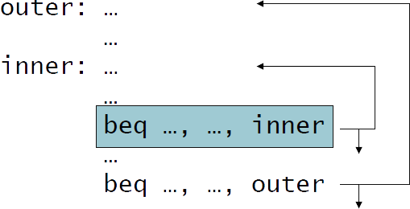

# 4.8. Control Hazards
["4.5. An Overview of Pipelining" 복기하기](https://github.com/gjlee0802/computer-architecture/blob/main/4_5-an-overview-of-pipelining.md#9-control-hazards)

## 1. Branch Hazards
* branch의 결과가 MEM 단계에서 결정된다면?
* Control hazard 파트에서,
    * branch 결과를 알기 위해 기다리는 것 대신 "아닌 것으로 가정"하여 연속된 명령어를 수행하다가 아니면 그대로, 맞으면 제대로 명령어 가져와서 수행하기로 함
    * 만약 결과가 맞으면 그동안 미리 예측하여 수행해둔 명령어는 버려야 함
    * 제어 신호를 0으로 하여 비워야 함 (flush)

## 2. Reducing Branch Delay
예측에 실패하더라도 수행해둔 명령어가 버려지는 단계를 줄여보자  

* branch 결과 구하는 것을 ID 단계에서 할 수 있도록 하드웨어를 옮김 (ID Stage에 아래 하드웨어가 구성됨)
    * target address adder (대상 주소를 `PC+4+Offset(address*4) 해주던 ALU` 및 `Left shift`, `Sign extend`)
    * register comparator (ALU로 비교해서(빼서) zero인지 봤던)

* 예시: branch  
36: sub $10, $4, $8  
40: **beq** $1,  $3,  **7**  
44: and $12, $2, $5  
48: or  $13, $2, $6  
52: add $14, $4, $2  
56: slt $15, $6, $7  
...  
72: lw  $4, 50($7)     #(40+4)+**7***4=72  
  

* beq는 다음 stage들도 넘어가도 딱히 할 일은 없음
* 예측이 맞다면 상관없이 다음 명령어 계속 수행
* 예측이 틀리고 분기로 이동(jump)해야한다면,
    * 분기 대상 주소를 PC에 넣어 해당하는 명령어를 IF(Fetch)할 수 있도록 하고,
    * 이전에 IF 단계에서 Fetch한 직후 명령어는 ID로 들어오지만 폐기함(Flush)
* 기존 모델에서는 예측으로 실행해둔 여러 Instruction들을 버리면서 여러 Cycle의 Bubble이 발생하지만,
    * 하드웨어 구성을 통해 **ID 단계에서 branch 결과를 구하도록** 하여, **단 1번(IF 단계였던 직후 명령어)의 bubble 만으로 줄일 수 있음**

## 3. RECAP: Data Hazard의 정의는?
Data Hazard는 이전 명령어가 데이터를 읽거나 쓰는 것이 완료될 때까지 기다려야 하는 상황 (데이터 의존성에 의해)

## 4. Data Hazards for Branches

* 만약 branch에서 비교하려는 레지스터가 2 Cycle 전이나 3 Cycle 전의 ALU Instruction 결과(Rd)라면 (아직 레지스터에 값이 쓰이지 않음),
    * RAW 데이터 의존성에 의한 것이므로 Forwarding을 통해 해결 가능
        * 이전에 본 forwarding은 현재 cycle이 EX stage였음(ALU에 필요한 피연산자)
        * 그런데 이번에 보는 branch의 비교 ALU는 ID 단계에 있기 때문에, (1 Cycle / 2 Cycle 전 단계가 아닌) 2 Cycle / 3 Cycle 전 단계에 대해 forwarding 가능함
        * (1 전 명령어는 이제 막 EX를 수행하는 중이고, 2 전 명령어는 EX/MEM, 3 전 명령어가 MEM/WB)  

* 만약 비교하려는 레지스터가
    * 1 Cycle 전의 ALU Instruction의 결과(`ID/EX.RegisterRd`)이거나,
    * 2 Cycle 전의 load로 불러온 값을 쓸 레지스터(`EX/MEM.RegisterRt`)라면,
    * forwarding할 수 없고, stall이 발생할 수 밖에 없음

* 1 Cycle 전(직전) 명령어가 산술(add)일 때, 이제 EX 들어가려하기 때문에 값이 없을 것임
    * branch의 피연산자인 ALU의 결과는 1번의 Stall이 필요
* 2 Cycle 전 명령어가 load일 때, 이제 MEM 들어가려하기 때문에 값이 없을 것임
    * branch의 피연산자인 MEM read는 2번의 Stall이 필요

## 5. Dynamic Branch Prediction
* 초대형(Stage가 아주 많은) Pipeline일수록, branch 패널티(stall)은 중요해짐(커짐)
    * **Stage 수가 많으면** 나눠서 일을 하니 **속도가 올라가지만**, 그만큼 **Stall도 한꺼번에 여러 Cycle이 발생할 수 있음** (여러 Stage가 쉬어야 하기 때문)
    * 또한 복잡하기 때문에, branch 결과도 ID 단계가 아닌, ID stage 이후로 더 진행이 된 상태에서 알 수 있게 됨
        * 그러면 예상이 틀렸을 때, 미리 진행한 명령어들을 Flush하면서 Stall도 더 많이 발생

* 동적 예측(Dynamic Prediction)을 사용하는 것이 바람직함
    * **branch prediction buffer (aka. branch history table)을 둠**
    * 거쳐온 branch instruction의 주소들을 Index화(색인화)함
    * **분기 결과를 history table에 저장**해둠 (taken / not taken)
    * branch를 수행하려면
        * **테이블을 살펴보고 추론한 예측을 바탕으로**, 예측과 같길 바라면서 진행하기로 함
        * 분기 결과가 taken이든 not taken이든, 예측한대로의 명령어를 가져와서 진행함
        * 만약 틀렸다면, 예측대로 수행했던 명령어를 비우고(flush) 예측과 반대되는 명령어를 Fetch함

## 6. 1-Bit Predictor: Shortcoming(결점, 단점)
1-Bit, 바로 전의 결과만 사용하는 경우

* 다중 loop에서, 안쪽 loop branch는 예측 실패를 2번 함(처음, 마지막)

* 안쪽 loop의 반복 중 마지막에서,
    * 예측 실패(mispredict)는 일어날 것(taken)으로 나타남
    * 원인: 안쪽 loop는 항상 일어나서(taken) 내부가 반복되었기 때문에 이번에도 그럴 것으로 예측
* 안쪽 loop의 반복 중 첫번째에서,
    * 예측 실패(mispredict)는 일어나지 않을 것(not taken)으로 나타남
    * 원인: 안쪽 loop의 가장 최근은 일어나지 않고(not taken), 밖으로 나가서 바깥 loop가 안쪽을 다시 시작한 것이라, 이번에도 안쪽은 최근대로 일어나지 않을 것으로 예측

## 7. 2-Bit Predictor
* 두번의 연속된 예측실패(misprediction)이 일어나야만 예측기준의 결과(predictor가 판단할)를 역전시킴  
    * 11 <--> 10 <--> 01 <--> 00  

## 8. Calculation the Branch Target(address)
* branch 명령어를 위해 기존의 EX stage에서였든, ID stage로 옮겼든, 대상 주소를 계산해야 함
    * 대상 주소 계산: rs(PC+4) + address*4
* predictor을 사용하더라도 여전히 대상 주소는 계산해야 함
    * branch마다 1 Cycle의 패널티 발생
* branch target buffer
    * 반복될 branch라면 아예 대상 주소(바뀌지 않고 고정된 메모리 주소)를 기억해두고 재활용하자는 취지
    * 대상 주소의 캐시(Cache)로 활용됨
    * IF(Instruction Fetch) 때, PC에 의해 Index화(색인화)됨
        * 만약 예측이 적중하면, 대상 주소의 명령어를 즉시 Fetch할 수 있음(이미 buffer에 있는 주소라면, 주소 계산 오버헤드가 해소됨)
