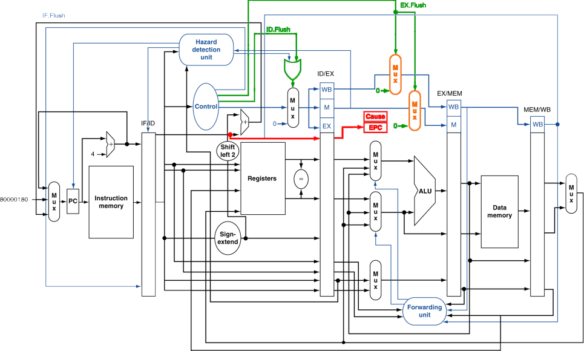

# 4.9. Exceptions
## 1. Exceptions and Interrupts
* 프로그램이 실행 중에 "**예상치 못한**" 상황 발생할 때, 이를 처리하기 위해 실행 흐름을 변경해야 함
    * 이때 발생하는 것이 예외(Exception)와 인터럽트(Interrupt)
    * 다른 ISA마다 용어(term)를 다르게 사용
        * ISA(Instruction Set Architecture, 명령어 집합 구조)마다 예외와 인터럽트를 다르게 정의하는 경우가 있음
        * 어떤 CPU는 예외도 인터럽트의 한 종류로 간주

* Exception(예외)은 CPU 내부에서 발생
    * e.g., undefined opcode, overflow, syscall, ...

* Interrupt(중단)은 외부 I/O Controller(CPU 외부의 장치, OS 등...)로부터 발생

* Exception vs. Interrupt
    | 구분 | 예외 (Exception) | 인터럽트 (Interrupt) |
    |------|----------------|----------------|
    | 발생 원인 | 프로그램 내부 문제 (0 나누기, 메모리 접근 오류 등) | 외부 장치 이벤트 (키보드 입력, 네트워크 요청 등) |
    | 발생 시점 | 명령어 실행 중 | 명령어 실행과 무관하게 언제든지 발생 |
    | 처리 방식 | CPU가 예외 핸들러(Exception Handler) 호출 | CPU가 인터럽트 핸들러(Interrupt Handler) 호출 |

* Trap이란?
    * Software Interrupt라고도 불림
    * syscall 활용하여 명령어가 Interrupt를 발생시킴
    * 원래 Interrupt는 HW에서 발생시키지만, SW적으로 호출해서 발생시키는 경우

* 이 문제를 다루기 위해서는 어느정도의 성능 저하를 감수해야 함

## 2. Handling Exceptions
* MIPS에서, Exception은 System Control Coprecessor(CP0)에 의해 관리됨
* 문제가 생긴(offending, interrupted) Instruction의 PC(즉, 현재 Instruction 주소)를 저장함
    * MIPS에서는 문제 생긴 PC값을 **EPC(Exception Program Counter)에 저장**
* 문제의 종류(indication. 표시,원인)를 저장함
    * MIPS에서는 문제의 종류를 **Cause Register에 저장**
    * 예를 들어, 1-bit로 가정한다면,
        * undefined opcode는 0, overflow는 1로 저장하는 방식
        * 실제로는 여러 문제 종류가 존재
* 위의 EPC, Cause Register 등에 저장 후에는
    * 미리 정해진(8000 00180) 메모리 주소에 위치한 handler로 jump하는데,
    * 여기서 EPC와 Cause Register의 값 등을 이용하여 처리하게 됨

## 3. An Alternate Mechanism - 다른 방식(좀 더 발전된 방식) 알아보기
* Vectored Interrupts
    * 원인에 따른 handler 주소가 다르게 정해져 있음
    * 즉, 미리 정해진 메모리 주소의 handler로 jump하는 것이 아니라, 각각의 원인에 handler 주소가 정해짐
    * 예시:
        * undefined opcode:　C000 0000
        * overflow:　　　　　 C000 0020
        * ...:　　　　　　　 　 C000 0040
* 문제가 발생한 Instruction은 다음 중 하나로 진행됨
    * (드물게) 문제가 발생했을 때, 예외(또는 인터럽트) 핸들러가 즉시 문제를 해결하는 경우
        * 그러나, 대부분의 경우에는 발생한 문제를 해결하려면 더 복잡한 처리가 필요함
    * 처음 실행된 핸들러가 "**이 문제를 제대로 해결할 수 있는 Real Handler**"로 이동(jump)해서 처리하는 경우

## 4. Handler Actions
* 원인을 읽고, 관련된 handler로 이동(jump)
* handler는 필요한 동작을 결정함
* 만약, **해당 명령어를 재시작** 가능하다면
    * 적절한 동작으로 시정하여 동작시킴
    * **EPC를 이용하여 원래 실행 중이던 명령어(원래의 PC)로 돌아갈 수 있도록 함**
* 그렇지 않다면
    * 프로그램을 중단(terminate)
    * EPC, cause, ... 등을 이용하여 error를 보고(report error)

## 5. Exceptions in a Pipeline
* Control Hazard의 또 다른 형태
    * Control Hazard는 프로그램의 flow가 바뀔지도 몰라 직후 명령어가 바로 실행될 수 없는 hazard를 말함
    * Exception도 발생하면, 다음의 명령어들이 실행되지 못하고 Exception을 처리해야 함
* 아래 add 명령어의 EX Stage에서 Overflow가 발생했다고 생각해봤을 때, Exception 처리 과정은 아래와 같음
    ~~~
    add $1, $2, $1
    ~~~
    * `$1`에 잘못된 값이 쓰여지는 것을 막음
    * 이전 Instruction들은 제대로 완수될 수 있도록 함
    * add 명령어와 이후 명령어들을 비움 (Flush)
    * **EPC와 Cause Register의 값 세팅**
    * **handler로** 제어권을 넘김 (handler가 처리할 수 있도록 jump)
* 예측 실패한 branch와 유사함!
    * **프로그램 흐름(Control Flow)이 변경됨**
        * 분기 예측 실패
            * 예측된 분기 방향에서 잘못된 예측임을 깨닫게 되면 올바른 분기 방향으로 되돌아감
            * 명령어를 취소(Flush)하고 올바른 명령어를 실행
        * Exception
            * Exception이 발생하면 이후 명령어를 실행할 수 없음
            * 이후 명령어들을 취소(Flush)하고, Exception Handler로 jump
    * **파이프라인에서 명령어를 취소(Flush)하는 과정이 동일**
    * **동일한 HW 자원을 사용**
        * branch 예측 실패와 예외 발생 모두, 현재 실행 중인 명령어의 실행을 멈추고 새로운 PC(주소)를 설정해야 함
            * 이를 위해 EPC와 같은 레지스터를 사용하여 새로운 명령어 실행을 준비

## 6. Pipeline with Exceptions

* 추가된 부분을 주목할 것  
    * Flush 관련 Control 신호: ID.Flush, EX.Flush
    * EPC와 Cause Register
* 추가된 장치 외에도, 기존의 장치를 많은 부분 함께 활용하여 exception을 처리  

## 7. Exception Properties(특성)
* 재실행 가능한 명령어에 대한 Exception 처리 과정
    * Pipeline은 명령어를 비움 (Flush)
    * Handler가 처리 후, 원래의 instruction으로 돌아감
    * 이번엔 시정된 instruction을 실행함
* EPC 레지스터에 PC가 저장됨
    * 문제가 발생한 instruction을 식별가능
    * 실제론 PC+4가 저장될 것
    * Handler가 반드시 조정해야 함(-4를 PC에 넣어줘야 해당 instruction으로 돌아감)

## 8. Exception 예제
TODO