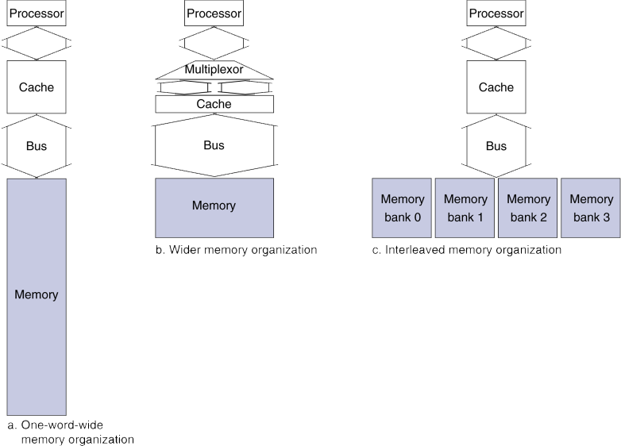

# 5.1. Introduction
* https://ydeer.tistory.com/146

## 1. Principle of Locality: 지역성의 원칙
* 프로그램은 언제나 주소공간(메모리)의 아주 작은 일부분에 접근함(access)
    * 즉, **access하는 부분을 계속 access할 확률이 높음**
* Temporal(시간적인) locality(지역성)
    * **최근에 access한 항목은 아마 곧 다시 access할 확률이 높음**
    * e.g., loop에서의 instruction, induction 변수(반복문의 i)
* Spatial(공간적인) locality
    * 최근에 access한 항목 **근처의 것들을 아마 곧 access할 확률이 높음**
    * e.g., 연속되는(순차적인, sequential) instruction access, array 데이터

## 2. Taking Advantage of Locality: 지역성을 활용
* Memory hierarchy(계층)
    * 자주 사용하는 데이터를 점점 고속의 임시 저장소로, CPU에 가깝게.
* disk에 모든 것을 저장(store).
* 최근에 access한(그리고 주변들의) 항목들을 disk에서 작은 DRAM 메모리로 복사한다.
    * 메인 메모리(고속)
* 좀 더 최근의 항목들은 DRAM에서 더 작은 SRAM 메모리로 복사한다.
    * CPU에 붙은(CPU와 통합된) 캐시 메모리(초고속)

## 3. Memory Hierarchy Levels: 메모리 계층의 단계
* block(aka. line): 복사의 단위(unit of copying)
* 만약 원하는 데이터가 상층부(Upper Level, Faster, Cache)에 존재한다면,
    * Hit(적중): 상층부에서 access 성공
        * Hit Ratio: hits/accesses
* 만약 원하는 데이터가 없다면,
    * Miss: 하층부(Lower Level, Slower)에서 block을 복사
        * 시간 소요: Miss Penalty
        * Miss Ratio: misses/accesses = 1 - `Hit Ratio`
    * 상층부로 복사해오고 나서는 상층부에서 데이터를 access

## 4. Characteristics of the Memory Hierarchy: 메모리 계층의 특징
* Access time
    * 프로세서와 가까울수록 Upper Level
        * 더 빠르고 용량은 작음
    * 프로세서와 멀수록 Lower Level
        * 더 느리고 용량은 큼
* Inclusive(포함)의 특성
    * L1$는 L2$의 subset(일부분)
    * L2$는 메인메모리의 subset
    * 메인메모리는 2차 메모리의 subset

## DRAM SKIP: 5~8

## 9. Main Memory Supporting Caches: 캐시(SRAM)를 돕는 메인메모리(DRAM)
* DRAM을 메인메모리로 사용
    * 고정된 사이즈(width), e.g., 1-word
        * **고정된 사이즈의 데이터를 access**

* Cache block read의 예시로, 아래와 같은 조건이라면,
    * address transfer에 1 bus cycle
    * DRAM access에 15 bus cycle
    * data transfer에 1 bus cycle
* 4-word짜리 block을 access할 때, 1-word-wide(1번에 1-word 단위로 access) DRAM에서,
    * Miss Penalty = `1(address transfer)` + `4*15(DRAM access)` + `4*1(data transfer)` = 65 bus cycle
    * Bandwidth = 16 bytes / 65 cycles = 0.25 byte / cycle

## 10. Increasing Memory Bandwidth: 메모리의 대역폭을 늘려보자
  
1-word-wide DRAM은 `a. One-word-wide memory organization`에 해당  

* 4-word-wide memory (`b. Wider memory organization`에 해당)
    * 긴 word를 다루니까, 메모리에도 긴 word 단위로 접근 (데이터 교환도 긴 word로)
    * Miss Penalty = 1 + 15 + 1 = 17 bus cycle
    * Bandwidth = 16 bytes / 17 cycles = 0.94 byte/cycle

* 4-bank interleaved memory (`c. Interleaved memory organization`에 해당)
    * 실제로 주로 사용되는 방식
    * bank는 I/O가 독립적으로 이루어질 수 있는 단위
    * Miss Penalty = 1 + 15 + 4*1 = 20 bus cycle
    * Bandwidth = 16 bytes / 20 cycles = 0.8 byte/cycle

* 성능은 b가 가장 좋지만, 많은 하드웨어 자원이 사용되어 c를 주로 사용
    * c는 하드웨어 자원은 a와 유사하게 사용하면서, 성능은 b에 근접
