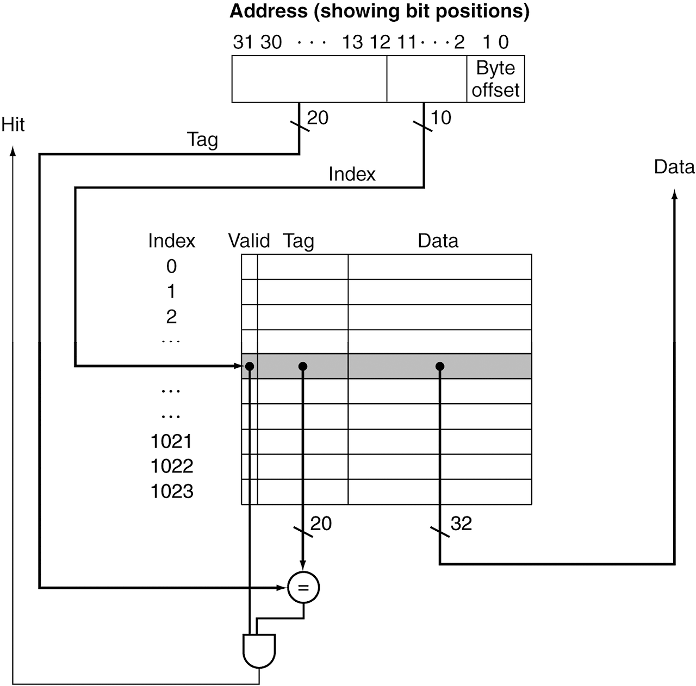

# 5.3. The Basics of Caches
* https://ydeer.tistory.com/146

## 1. Cache Memory
* Cache Memory
    * 메모리 계층에서 가장 CPU와 근접한 단계
    * Question 1: 데이터가 현재 Cache에 존재하는지 어떻게 알 수 있는가?
    * Question 2: 어디를 살펴봐야 하는가?

## 2. Caching: 간단한 첫번째 예제
### 메인메모리 주소 구조
~~~
[ 상위 2비트 | 중간 2비트 | 하위 2비트 ]
~~~
* 하위 2비트: Word 내부의 바이트 선택 용도 (Word를 찾을 때는 불필요)
* 중간 2비트: 캐시의 **Index**로 사용됨 (캐시의 어느 line에 매핑되는지)
* 상위 2비트: 캐시의 **Tag**로 사용됨 (캐시에서 데이터 출처를 확인하는 용도)

* 예시로는 메인메모리에 16개의 word blocks

### 캐시와 메인메모리의 매핑

* 하위 2 bits(LSB, Least Significant Bits)는 **word 안에서의 byte를 정의하는데 쓰이므로**, 한 word 자체(one word block)을 읽을 때는 신경쓰지 않음.
    * 앞의 4bits를 주목하면(예시에서는),
        * 총 6bits 중 중간 2bits는 Cache의 index에 쓰임
            * 캐시의 어느 열(line)에 매핑되는지
        * 상위 2bits는 Cache의 Tag에 쓰임

* 캐시는 메인메모리와 어떤 식으로 매핑이 이루어지는가?
    * 메인메모리는 16 blocks, 캐시는 4 lines
    * 캐시는 line 별로, 메인메모리의 block 중에서, 각자 정해진(index가 일치하는) 4개의 word block 중 1가지를 매핑함
    * 메인메모리 주소의 그 다음 2bits(캐시의 index)로 캐시의 line위치를 결정
    * 캐시의 tag와 메인메모리 주소의 상위 2bits를 비교하여, 캐시에 메모리 block이 있는지 알 수 있음

* 캐시 - 메인메모리 매핑 예시
    * 캐시에서, index **10**인 line에는 00**10**xx, 01**10**xx, 10**10**xx, 11**10**xx 중 하나가 매핑되어 있을 것
        * 이제 tag(상위 비트)를 보고, 찾으려는 메모리 주소의 상위 2 bits를 비교하여 찾는 데이터가 캐시에 있는지 확인
            * 맞으면 hit
            * 다르면 miss
        * 메인메모리의 주소(block address)들을, 캐시의 block들의 수로 나머지 연산 한 것이 index가 됨

## 3. Direct Mapped Cache
* 위치가 주소로 결정됨
* 메인 메모리의 한 Block이 캐시의 특정한 한 Line에만 저장될 수 있는 구조
    * 즉, 메모리의 특정 블록이 캐시에서 저장될 수 있는 위치(캐시의 Line)가 오직 하나로 결정됨
* 캐시 Index = (메모리 Block 주소) % (캐시의 블록 수)

## 4. Tag and Valid Bits
* 캐시의 위치에 매핑된 데이터가, 메모리의 어느 특정 block와 일치하는지 어떻게 알 수 있는가?
    * 블록 주소를 데이터처럼 저장
    * 실제로는, 오직 상위 비트들(tag)만 필요
* 만약 캐시에 데이터가 없다면?
    * Valid bit가 1이면 존재하는 것, 0이면 없는 것을 의미
    * 처음엔 0으로 시작

## 5. Cache 예제
* Cache Index가 같은 다른 데이터가 들어오면, 새로 쓰여짐(덮어씀)

## 6. MIPS Direct Mapped Cache 예제
~~~
1 word block, Cache size = 1K words (or 4KB)
~~~

* 캐시 Index(1024개를 위한 비트)는 1024 = 2의 10승 이므로, 10개의 비트
    * 최하위 2비트(0~1 자리)를 뺀, 2~11자리의 10개 비트 사용
* block이 1 word로 되어있으므로, 하위 2비트는 무시 가능
    * 2비트로 인한, 4가지 구성이 1 word가 됨
* 나머지 비트인 상위 20비트(12~31자리)가 tag가 됨
* 캐시 메모리에서, 데이터는 32비트, index는 10비트, tag는 20비트, valid는 1비트

* 이 캐시는 어떤 Locality(지역성)을 활용하고 있는가?
    * Temporal Locality(시간적 지역성)만 활용
        * Spatial Locality가 아닌, 최근 데이터를 직접 접근

## 7. Example: Larger Block Size
~~~
64 Blocks, 16 Bytes/Block (4 word/block)라고 가정

즉, 메모리에 총 64개의 블록 존재
각 블록이 한 번에 16바이트 데이터를 저장
~~~

* Block Number: 메인 메모리에서 블록 단위로 데이터를 나누었을 때, 각 블록이 가지는 고유한 번호

* **메인메모리의 주소가 1200인 block**은 어떤 block number에 mapping되는가?
    * 16 byte를 위해, **최하위 4비트를 Offset으로 사용**
        * 즉, 주소 중 최하위 4자리는 캐시 저장에 무시
    * right shift 4로써, 2의 4승인 16으로 나누면,
        * block address = **1200 / 16** = 75
    * 64개(2^6)의 block이니, 그 위 **6비트를 index로 사용**
        * 유의미한 **75를 block의 수로 나머지 연산**을 하면,
            * **block number = 75 % 64 = 11**
    * 나머지 22비트를 tag로 사용

## 8. Multiword Block Direct Mapped Cache: 캐시의 블록에 여러 word 저장
* 16 words/block. cache size = 4K words

* 16 words = 16*4 bytes = 2의 6승 bytes, 즉 **최하위 6비트를 Offset으로 사용**
    * word 단위로 access하므로, 이 중 word offset은 최하위 2비트(0~1자리)
    * 그 위 4비트(2~5자리)가 block offset
* 캐시 사이즈는 4K words = 2^12 words = 2^(4+8) words
    * 즉, 2^8의 block이니, 블록 수는 256개
    * **Offset의 상위 8비트(6~13자리)는 Index로 사용**
* 나머지 최상위 18비트는 Tag로 사용
* 한 block에 16개의 word가 담기지만, CPU가 access하는 것은 1 word
    * 즉, MUX를 사용하며, 여기에 block offset을 통해 블록의 몇 번째 word에 access할지 결정

## 9. Block Size Considerations: 블록 크기 고려사항 (블록이 커질 경우)
* 블록이 클수록 miss rate는 감소한다
    * Spatial Loacality에 의해
* 하지만 캐시의 크기는 고정되어 있음!
    * 캐시의 크기는 고정되어 있는데, **block의 크기가 커지면: 캐시의 line(캐시의 블록)의 개수는 줄어듦**
        * line 개수가 줄어든다는 것은...
            * 하나의 line이 **mapping 되어야 할 메모리 위치가 늘어나게 된다는 것**
            * refresh가 자주 일어나고, **경쟁(competition)이 잦아짐** => miss rate 증가
    * 블록이 클수록, 캐시의 line에 read/write가 자주 발생하면서 오염됨
        * refresh 때 overhead가 더 커질 수 있음
* 블록이 클수록, Miss Penalty도 커짐
    * miss가 발생했을 때마다, 한 번에 더 큰 block을 읽어와야 함
        * miss rate를 감소 시키려다가, 전체적인 성능이 저하될 수 있음

## 10. Cache Misses
* 캐시가 적중(hit)했을 때, CPU는 보통처럼 동작함
* 캐시가 적중 실패했을 때는
    * CPU Pipeline에 Stall을 발생시킴
    * 메모리의 다음 계층(Lower Level)에서 해당 block을 fetch해옴
    * Instruction Cache Miss였다면,
        * 다시 Instruction Fetch가 될 수 있도록 함
    * Data Cache Miss였다면,
        * Data Access를 완료함

## 11. Write-Through: 즉시 메모리에 반영
~~~
"데이터가 변경될 때마다, 캐시와 메인 메모리에 동시에 반영하는 방식"
~~~
* data-write가 발생하면, 메모리가 아닌 캐시의 블록을 바로 업데이트할 수 있음
    * 하지만 메모리와 캐시의 일관성이 없어짐 (원본 메모리는 old, 캐시만 new)

* Write-Through Policy(정책): 그러므로, **캐시와 함께 메모리 또한 업데이트**
    * 이러한 캐시를 Write-Through Cache라고 함

* 그러면 write가 더 오래 걸림
    * e.g., 만약 기본 CPI가 1이고, Instruction의 10%가 store 명령어이고, 메모리에 write하는데 100 Cycles가 걸린다면,
        * 유효 CPI = 1 + 0.1 * 100 = 11

* 해결책: **write buffer**
    * 메모리에 쓸 data를 여기서 가지고 있음
    * 메모리에 write가 될 때까지 CPU는 즉시 계속 진행(write buffer에 있는 data를 사용)
        * 메모리에 write가 될 때까지 기다리지 않아도 됨
        * write buffer가 이미 가득 차있을 때에만 Stall 발생

## 12. Write-Back: 나중에 한 번에 반영
~~~
"데이터가 변경될 때, 캐시에만 반영하고 메모리에는 나중에 필요할 때 한 번에 저장하는 방식"
~~~

* 대안책: data-write가 발생하면, 메모리가 아닌 캐시의 블록만 바로 업데이트함
    * 메인메모리와 캐시의 데이터가 달라짐
        * 이제 데이터가 다른지 같은지 알아야 함
    * **각 블록이 다른지 추적**해야 함 (**Dirty bit를 둠**)

* dirty block이 제거될 때에
    * 즉, 캐시의 데이터가 유효값인데, 해당 line에 교체 등의 이유로 캐시에서 빠져나가야 될 때
    * 그 때에 메모리에 Write-Back
    * 여기에도 Write buffer을 활용하여 메모리에 쓰는 걸 CPU가 기다리지 않도록 할 수 있음

### Dirty bit의 역할과 이점
**Dirty Bit**: **캐시에서 수정된 데이터가 메인 메모리에 반영되었는지 여부를 표시하는 비트(0 또는 1)**  
✅ 불필요한 메모리 쓰기 방지 → 수정되지 않은 데이터는 메모리에 저장하지 않음  
✅ 성능 향상 → 메모리 접근 횟수를 줄여 속도를 높임  
✅ Write-Back 방식에서 필수적 → 변경된 데이터만 메모리에 반영해야 하므로 Dirty Bit이 필요함  

### Write-Back 시나리오
~~~
1️⃣ CPU가 Block 0을 수정함 => 캐시의 블록만 업데이트 (Dirty Bit = 1).
2️⃣ CPU가 새로운 Block 4를 요청함.
3️⃣ Block 4가 캐시에서 저장될 위치(캐시 Index 0)를 찾아보니, 이미 Block 0이 들어 있음.
4️⃣ Block 0이 Dirty 상태이므로, 캐시에서 제거되기 전에 메모리에 저장됨 (Write-Back 실행).
5️⃣ Block 4가 캐시에 저장됨.
~~~

## 13. Write-Through vs. Write-Back 비교
### 비교 Table
| 특성            | Write-Through      | Write-Back         |
|---------------|------------------|------------------|
| **메모리 반영 시점** | 데이터 변경 즉시 반영 | 캐시에서 데이터가 교체될 때 반영 |
| **메모리 접근 횟수** | 많음 (느림)        | 적음 (빠름)        |
| **데이터 일관성** | 항상 보장됨         | 보장되지 않을 수 있음 |
| **성능**       | 낮음              | 높음              |
| **사용 환경**  | 안정성이 중요한 경우 (예: 은행, 데이터베이스) | 성능이 중요한 경우 (예: 게임, 고속 연산) |

### 언제 Write-Through, 언제 Write-Back 사용?
* Write-Through:
    * 데이터 일관성이 중요한 경우 (예: 금융 시스템, 데이터베이스)
    * 캐시 손실이 치명적인 경우 (메모리에 항상 최신 데이터가 있어야 하는 경우)
* Write-Back:
    * 성능이 중요한 경우 (예: 게임, 실시간 데이터 처리)
    * 캐시 히트율이 높은 경우 (캐시에 데이터가 오래 남아 있어서 메모리 접근을 줄일 수 있는 경우)

## 14. Write Allocation: 할당
* Write miss가 발생한다면 어떻게 되는가?

* Write-Through의 대안(Alternative)
    * Allocate on miss: block을 fetch
    * Write around: block을 fetch하지 않음
        * 그러면 그냥 캐시에는 write하지 않고, 메모리만 직접 업데이트

* Write-Back의 대안(Alternative)
    * 주로 Fetch the block

## 15. 예제: Intrinsity FastMATH
* Embedded MIPS processor
    * 12-stage pipeline
    * 각 Cycle마다 Instruction과 Data의 acccess. 즉, access마다 1 cycle 소요

* Split cache: I-cache와 D-cache가 나뉘어져 있음
    * Instruction Cache / Data Cache
    * 각각 16KB: 256 blocks * 16 words/block
    * D-cache: write-through / write-back

