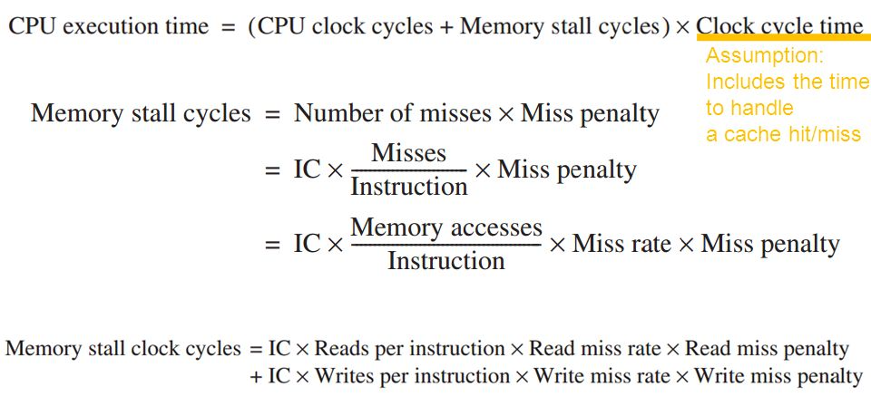
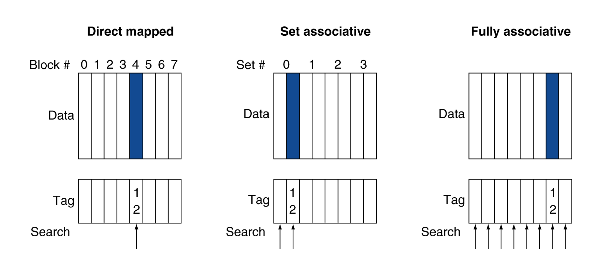
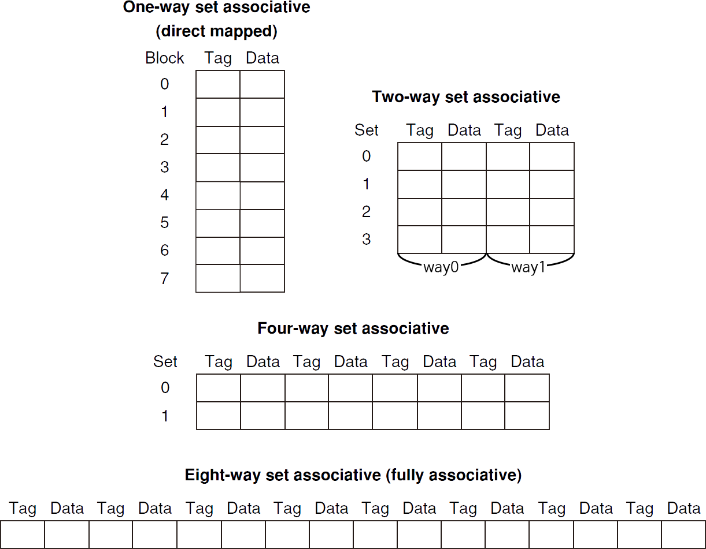
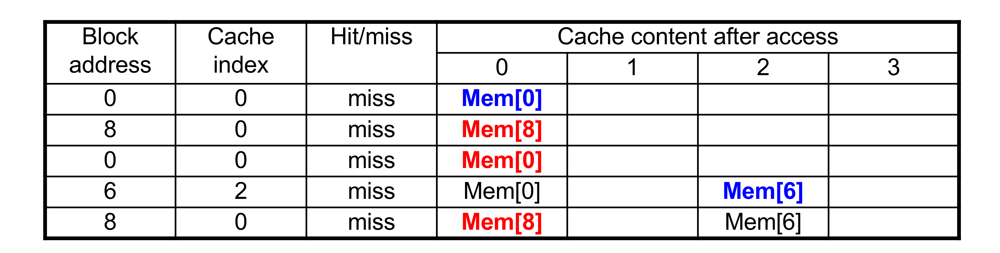
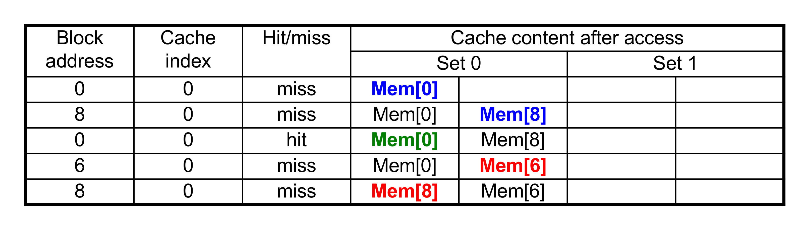
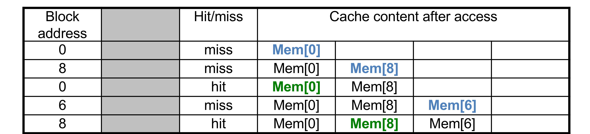

# 5.3. Measuring and Improving Cache Performance
* https://ydeer.tistory.com/146
* https://velog.io/@saewoohan/Ch-5-Large-and-Fast-Exploiting-Memory-Hierarchy

## 1. Measuring Cache Performance
* CPU time의 요소(종류)들(components)
    * program executiuon cycles
        * cache hit time을 포함
    * memory stall cycles
        * 주로 cache miss들로 부터 발생
* 간결화 가정(simplifying assumption)을 해보면,

### (a). Cache Performance Exmaple
#### <문제에서 주어짐>
* I-cache miss rate = 2%
* D-cache miss rate = 4%
* Miss penalty = 100 cycles
* Base CPI (ideal cache) = 2
* Load & stores are 36% of instructions

#### <문제 풀이> 

**Step 1. [해석]:**  
(1) 캐시 미스율 (Cache Miss Rate)
* I-cache miss rate (명령어 캐시 미스율) = 2%
* D-cache miss rate (데이터 캐시 미스율) = 4%

(2) 미스 패널티 (Miss Penalty)
* Miss penalty = 100 cycles
    * 캐시 미스가 발생할 때마다, 데이터를 메모리에서 가져오는 데 추가로 100 사이클이 걸림

(3) 이상적인 CPI (Cycles Per Instruction)
* Base CPI (ideal cache) = 2
    * 즉, 캐시 미스가 전혀 발생하지 않는 이상적인 경우, 1개의 명령어를 실행하는 데 평균 2 사이클이 걸린다고 가정

(4) 로드 및 저장 명령어 비율
* Load & Store instructions = 36% (0.36)
    * 전체 명령어 중 36%는 메모리에서 데이터를 가져오거나 저장하는 명령어

**Step 2. [Instruction당 Miss Cycles 계산 과정]:**  
**Cache miss로 인해 추가되는 Cycle 수**를 계산하기!  
  
(1) I-cache(명령어 캐시)로 인한 추가 사이클
* **I-cache miss는 2% 확률(0.02)로 발생, 미스가 발생하면 100 사이클의 패널티가 존재**
* 따라서, 1개의 명령어당 평균적으로 cache miss로 인해 추가되는 사이클은...
    * 0.02 x 100 = 2
    * 즉, **I-cache 때문에 평균 2 사이클이 추가됨**

(2) D-cache(데이터 캐시)로 인한 추가 사이클
* 전체 명령어 중 36% (0.36)가 Load&Store 명령어
* **Load&Store 명령어가 실행될 때, D-cache miss는 4% 확률(0.04)로 발생, 미스가 발생하면 100 사이클의 패널티가 존재**
* 따라서, 1개의 명령어당 평균적으로 cache miss로 인해 추가되는 사이클은...
    * 0.36 x 0.04 x 100 = 1.44
    * 즉, **D-cache 때문에 평균 1.44 사이클이 추가됨**

(3) 계산 결과: Instrution당 Miss cycles
* **I-cache Miss Cycle**: 0.02 * 100 = 2
* **D-cache Miss Cycle**: 0.36 0.04 100 = 1.44

**Step 3. [Actual CPI(Cache Miss로 인한 실제 CPI) 계산 과정]:** 

Actual CPI는...
~~~
`Base CPI(이상적인 경우)` + `I-cache 영향` + `D-cache 영향`
~~~
 Memory Stall은 메모리 접근 시 발생하는 지연 시간(stall cycles)을 의미하며, 보통 I-cache 미스와 D-cache 미스에 의해 발생하는 stall을 합한 값으로 볼 수 있음.

Actual CPI = 2 + (2 + 1.44) = 5.44
* Ideal CPU is 5.44/2 = 2.72 times faster

## 2. Average Access Time
* Hit time도 performance에 중요하다.
* Average memory access time (AMAT)
    ~~~
    AMAT = Hit time + Miss rate * miss penalty
    ~~~
* Example
    * CPU with 1ns clock, hit time = 1 cycle, miss penalty = 20 cycles, I-cache miss rate = 5%
    * AMAT = 1 + 20 * 0.05 = 2ns
        * CPI: 2 cycles per instruction

## 3. Performance Summary
* CPU 성능이 향상되면,
    * miss penalty가 더 중요해짐
    * miss penalty가 더 많은 비중을 차지하게 됨
    * 총 시간 중, 프로세서에게 소모되는 시간이 줄어들기에 "Memory에서 소요되는 시간"이 더 많이 차지함
* 감소하는 Base CPI (이상적인 경우)
    * 총 시간 중에, Memory Stall(I-cache Miss Cycle + D-cache Miss Cycle)에 소요되는 시간의 비중이 더 커짐
        * Actual CPI = Base CPI + Memory Stall
* 증가하는 Clock Rate
    * Memory Stall에 걸리는 CPU cycle이 더 많아짐

## 4. Associative Caches(연관 캐시)
### 4.1. 캐시의 매핑 방식 3 가지
| 방식                     | 저장 위치             | 검색 비용    | 충돌 확률 | 하드웨어 비용 |
|------------------------|-----------------|-----------|---------|--------------|
| **Direct-mapped**      | 한 개의 지정된 위치 | 1개만 비교 | 가장 높음 | 가장 낮음 |
| **n-way Set Associative** | 특정 set 내 n개의 위치 | n개 비교   | 중간    | 중간 |
| **Fully Associative**  | 어디든 가능          | 모든 entry 비교 | 가장 낮음 | 가장 높음 |

  
Fully associative는 set이 1개나 다름 없음  

### 4.2. Associative cache 비교: n-way set associative vs. Fully associative
* n-way set associative
    * 각 set은 n개의 entries
    * 블록이 저장될 set 결정 방법:
        * (Block Number) modulo (#Sets in cache) 를 사용하여 블록이 저장될 set을 결정함
        * set index = (Block number) % (# of sets)
            * 예를 들어, 캐시에 8개의 set이 있고, Block number가 27이라면:
                * 27 % 8 = 3
                * 즉, Block 27은 "Set 3"에 들어가야 함
    * 특정 데이터를 검색하려면, 해당 set의 entries들을 한번에 검색해야 함
    * n개의 comparator가 필요(Fully보다 HW 비용 저렴)

* Fully associative
    * block이 cache 어디에나 들어갈 수 있음 (특정 set에 묶이지 않음)
    * 특정 데이터를 검색하려면, 모든 entry를 한번에(동시에) 검색해야 함
    * entry마다 comparator가 필요함(HW 비용 높아짐)

### 4.3. Spectrum of Associativity

* 8개의 entry를 가진 캐시를 생각해보면, 아래의 4가지 구조가 가능함
    * entry는 tag와 data로 이루어져 있음. set 안에서 way 단위로 구분함
    * 1-way set associative는 direct mapped와 같음. set이 결국 block
    * set이 1개이고 그 안에 모든 entry가 속하는 구조는 결국 fully associative

  

### 4.4. Associativity Example
1. Direct mapped 캐시의 Cache index 계산
* 캐시 크기: 4 블록 (Index: 0~3)이라면,
    * Cache index = (Block address) % 4
~~~
Cache index = "Block address" % "캐시 크기"
~~~

2. n-way set associative 캐시의 Cache index 계산
* Set의 개수(n): 2-way (Set: 0~1)이라면,
    * Cache index = (Block address) % 2
    * 한 개의 인덱스(Set)에 2개의 Entry(라인, 슬롯)를 저장할 수 있음
    * 같은 Set 내에서는 2개의 블록 중 하나를 교체하는 방식 (LRU, FIFO 등) 사용.
~~~
Cache index = "Block address" % "Set의 개수"
~~~

#### 4-block의 cache들을 비교

Cache Size: 4-block  
Block address sequence: `0, 8, 0, 6, 8`  

* Direct mapped
  
    ~~~
    1️⃣ block address 0) cache index = 0 % 4 = 0  
    2️⃣ block address 8) cache index = 8 % 4 = 0  
    3️⃣ block address 0) cache index = 0 % 4 = 0  
    4️⃣ block address 6) cache index = 6 % 4 = 2  
    5️⃣ block address 8) cache index = 8 % 4 = 0  
    ~~~
5번의 access에 5번의 Miss 발생  

* 2-way set associative
  
    ~~~
    1️⃣ block address 0) cache index = 0 % 2 = 0  
    2️⃣ block address 8) cache index = 8 % 2 = 0  
    3️⃣ block address 0) cache index = 0 % 2 = 0  
    4️⃣ block address 6) cache index = 6 % 2 = 0  
    5️⃣ block address 8) cache index = 8 % 4 = 0  
    ~~~
5번의 access에 4번의 Miss, 1번의 Hit 발생  

* Fully associative
    
    ~~~
    ✅ Block이 캐시 어디든 저장될 수 있기 때문에 "Cache Index" 개념이 필요하지 않음.
    ✅ 대신, 캐시의 모든 엔트리(라인)를 검사해야 함.
    ~~~
5번의 access에 3번의 Miss, 2번의 Hit 발생

### 4.5. How Mush Associativity?
* Associativity를 증가시킬수록 Miss rate는 낮아짐
    * 하지만 점차 효율(Associativity의 효과)은 낮아짐

## 5. Replacement Policy: 교체 정책
* Direct mapped 캐시: no choice, 무조건 교체가 일어남
* Set assiciative 캐시:
    * non-valid인 entry가 있다면, 선호됨
    * 그 다음으로 **2 가지 방법** 중 선택
        * **LRU** (Least-Recently Used)
            * **가장 오랫동안 쓰지 않은 것을 교체**
                * 2-way, 4-way에서 사용할만하지만, 그 이상은 X
        * **Random**
            * High associativity에서는 LRU와 거의 유사한 성능 수준을 보임

## 6. Multi-level Caches
* Primary cache(L1 cache)는 CPU와 붙어있음
* Level-2 cache는 Primary cache miss가 발생했을 때만 접근
    * L1 cache보다 크고 느리지만, Main memory보다는 빠름
* Main memory는 L2 cache miss가 발생했을 때만 동작

### 6.1. Multi-level Cache Example: 'L1' CPI vs. 'L1+L2' CPI
#### <문제에서 주어짐>
* CPU base CPI = 1
* Clock rate = 4GHz `=> Clock rate가 주어지면, 1 Clock cycle 소요 시간 계산을 떠올리기!`
* Miss rate / Instruction = 2%
* Main memory access time = 100ns

* L2 Cache access time = 5ns
* global miss rate to main memory = 0.5%

#### <Primary cache (L1 cache)만 사용했을 때>
(1) Miss penalty 계산하기 (L1 cache miss => Main memory access penalty)
* Miss penalty = "메모리 접근 시간" / "클럭 시간"
    * 1 Clock cycle = 1 / Clock rate = 1 / 4GHz = 0.25ns
    ~~~
    Miss penalty = 100ns / 0.25ns = 400 cycles
    ~~~

(2) Effective CPI (유효 Cycles per Instruction) 계산하기
* Miss로 인한 추가 CPI = (Miss 비율) x (Miss penalty) = 0.02 x 400 = 8
* 즉, 총 CPI (Effective CPI)는 메모리 캐시 미스로 인해 CPI가 9까지 증가함
    ~~~
    Effective CPI = 1 + 8 = 9
    ~~~

#### <L2 cache를 추가했을 때>
* L2 cache를 추가하면 일부 L1 cache miss가 L2 cache에서 해결되므로, Main memory에 접근하는 횟수가 줄어듦

(1) Primary miss with L-2 hit: L1 miss 후, L2 hit 시 penalty 계산 (L1 cache miss => L2 access penalty)
* **L2 Access Penalty 계산** ("L2 cache 접근 시간" / "클럭 시간")
    * 1 Clock cycle = 1 / Clock rate = 1 / 4GHz = 0.25ns
    ~~~
    L2 Hit penalty = 5ns / 0.25ns = 20 cycles
    ~~~

(2) Primary miss with L-2 miss: L1 miss 후, L2 miss 시 penalty 계산 (L2 cache miss => Main memory access penalty)
* **Main memory Access Penalty 계산** (Miss penalty = "메모리 접근 시간" / "클럭 시간")
    * L2도 미스 발생하면 메인 메모리에 접근해야 함 (Main memory access time인 100ns 소요)
    * 1 Clock cycle = 1 / Clock rate = 1 / 4GHz = 0.25ns
    ~~~
    Miss penalty = 100ns / 0.25ns = 400 cycles
    ~~~

(3) Effective CPI 계산
* **Primary miss with L-2 hit CPI**: (L1 Miss 후 L2 Hit 비율) x (L1 Miss 후 L2 Hit penalty)
    * Penalty miss with L-2 hit rate = (전체 L1 Miss 비율) - (전체 메모리 Miss 비율)
        * = 0.02 - 0.005 = 0.015
    * L2 Hit penalty = 20 cycles (앞서 구함)
    * (Penalty miss with L-2 hit rate) x (L2 Hit penalty) = 0.015 x 20 = 0.3
* **Primary miss with L-2 miss CPI**: (메모리 Miss 비율) x (메모리 Miss penalty)
    * 0.005 x 400 = 2
* 따라서 총 CPI(Effective CPI)는...
    * CPI = 1 + (**Primary miss with L-2 hit CPI**) + (**Primary miss with L-2 miss CPI**) = 1 + 0.3 + 2 = 3.4

🎯 Penalty 계산 Point
~~~
Point 1. L1 Miss Penalty는 이미 "L2 Penalty"에 포함됨
✅ L1 miss가 발생하면, L2 캐시에 접근하는 시간은 당연히 발생하지만, 만약 L2에서 Hit가 나면 L2 Penalty만 적용하면 됨

Point 2. L2 Miss Penalty는 이미 "Main Memory Access Penalty"에 포함됨
✅ 하지만 L2에서도 Miss가 나면, 우리는 메모리에서 데이터를 가져와야 하고, 이때 "메모리 접근 시간(=400 cycles)"을 사용해야 함
~~~

#### <성능 비교: L1 캐시만 사용했을 때 vs. L1+L2 캐시 사용했을 때>
* L1 캐시만 사용한 CPI = 9
* L1 + L2 캐시 사용한 CPI = 3.4
* 성능 향상 비율 (Performance Ratio):
    * 9 / 3.4 = 2.6
    * 즉, L2 캐시를 추가하면 CPU 성능이 2.6배 향상됨

## 7. Multi-level Cache Considerations
* Primary cache (L1 cache):
    * **Hit time을 줄이는 것에 초점**을 둠
* L2 cache:
    * **Miss rate를 줄여서 메모리에 접근하는 것을 줄이는 것에 초점**을 둠
    * **Hit time은 전체 성능에 큰 영향 없음**
* 결과:
    * L1 cache는 Single cache보다 보통 작음
    * L2 cache는 L1 cache보다 더 큰 set associativity를 사용함 (Miss rate를 줄이는 것에 초점)
    * L1 block size는 L2 block size보다 더 작음 (Hit time을 줄이는 것에 초점)