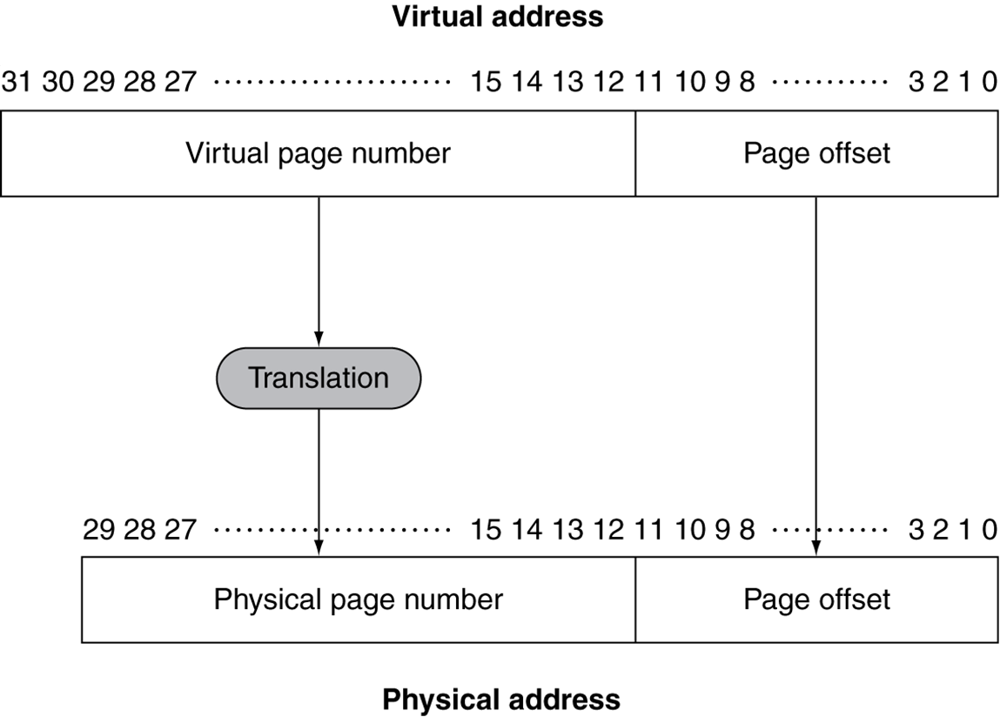

# 5.5. Virtual Memory
이제 캐시(SRAM)이 아닌, 메인메모리(DRAM)을 캐시처럼 사용하는 것에 대해 다룰 것임

## 1. Virtual Memory 개념
* 메인 메모리를 storage의 캐시로써 활용
    * Storage에서 많이 사용하는 것을 메인메모리에 올려 사용
    * CPU(HW)와 OS(SW)가 공동으로 관리함

* 프로그램들은 메인메모리를 공유하여 사용함
    * 각 프로그램들은 private한 virtual address space를 갖게되며, 자주 사용하는 code와 data를 여기에 두고 사용
    * 이 private한 영역들은 다른 프로그램으로부터 보호됨

* CPU와 OS는 가상 주소(Virtual Address)들을 물리 주소(Physical Address)로 번역함
    * Physical Memory의 Block 개념은 Virtual Memory에서 "**Page**"라고 불림
    * Miss는 Virtual Memory에서 "**Page Fault**"라고 불림

## 2. Address Translation
* 각각의 virtual address는 translation을 통해 physical address와 mapping이 됨
    * 하나의 Page는 하나의 Physical Address에 대응됨
* 메인메모리에 mapping이 되는 것도 있지만, storage에 mapping이 되는 것도 있음

### Example

* Fixed size pages (4KB pages, 전통적으로 4KB)
    * 그림의 예시는 2^12 = 4096 = 4KB의 Page size를 가짐
        * Page offset의 크기가 12비트인 것을 통해, 4KB의 Page size라는 것을 알 수 있음
            * 2^12 = 4096 = 4KB
    * Virtual memory (0~31, 총 32비트)는 2^32 = 4 * 2^30 = 4GB
        * Page offset인 12비트를 제외하면, **20비트** => **Virtual Page Number**
    * Physical memory (0~29, 총 30비트)는 2^30 = 1GB
        * Page offset인 12비트를 제외하면, **18비트** => **Physical Page Number**
    * 4GB인 Virtual address 공간이 1GB인 Physical address 공간으로 번역되어야 함
        * 즉, 2^20인 Virtual Page Number을 2^18인 Physical Page Number로 번역해야 함

## 3. Virtual Addressing with a Cache
* **CPU에서 사용하는 Virtual address 와 Cache에서 사용하는 Physical address 사이에 Translation 과정이 필요**
    * CPU(프로그램)가 사용하는 주소는 Virtual address
    * Cache가 사용하는 주소는 Physical address
* VA(Virtual Address) to PA(Physical Address)의 **번역 과정에, 추가적인 메모리 접근이 필요**
    * Translation 정보가 메인메모리에 존재하므로, 메인메모리 접근이 필요
    * 그러나, 메인메모리 Access time은 Cache에 비해 훨씬 느림 => Overhead 발생
* 따라서, **TLB(Translation Lookaside Buffer)의 HW를 사용**하여 이 문제를 해결함

### TLB란?
가상 주소를 물리 주소로 번역할 때  
매번 메인메모리의 Page Table을 탐색하지 않도록,  
최근에 주소 번역에 사용한 주소 mapping 정보를 보관하는 캐시  

## 4. Page Fault Penalty
* RECAP - Page fault란?: 접근하고자 하는 Page가 메인메모리에 없는 것 (Cache에서의 Miss 개념)

* Page fault가 일어나면 page는 반드시 Disk(Storage)로부터 읽어와야(Fetch) 됨
    * 굉장한 시간이 소요됨
* Page fault rate (Page fault 발생률)을 **최소화하는 방안 2가지**
    * Fully Associative Placement 기법
        * 즉, 전체 Page Table의 translation 정보를 가져와서 갖고 있는 것
    * Smart Replace Algorithms
        * 즉, OS에서 정교한 알고리즘 사용

## Page Tables
* Page Table은 Placement(Translation) 정보를 갖고 있음
    * **PTE(Page Table Entry)들이 배열로** 되어 있음
    * **Virtual Page Number로 색인화(Index) 되어 있음**
    * CPU의 **Page Table 레지스터가 Physical Memory에 있는 Page Table을 가리킴**

* **Page가 메인메모리에 있다면**,
    * PTE(Page Table Entry)가 **Physical Page Number을 갖고 있음**
    * 그 외 다른 **상태 정보들도 비트로 가짐** (referenced, dirty, ...)

* **Page가 메인메모리에 없다면**,
    * PTE(Page Table Entry)는 **Disk에 있는 Swap Space의 장소를 가리키게 됨**