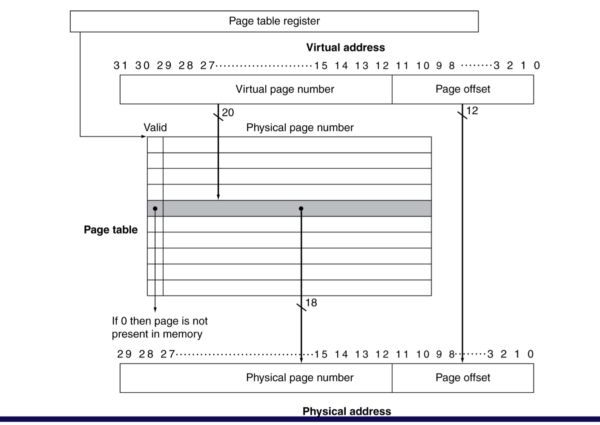
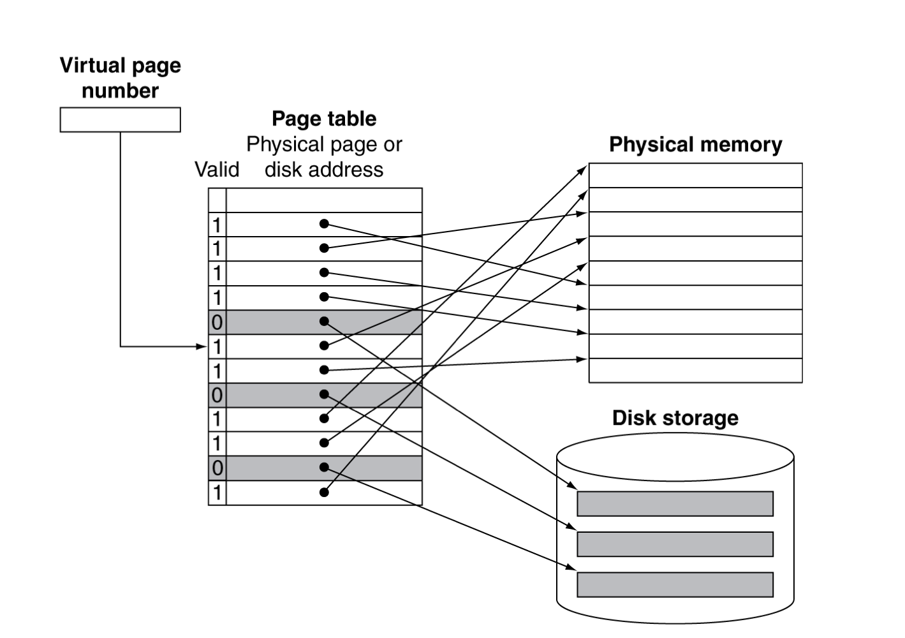
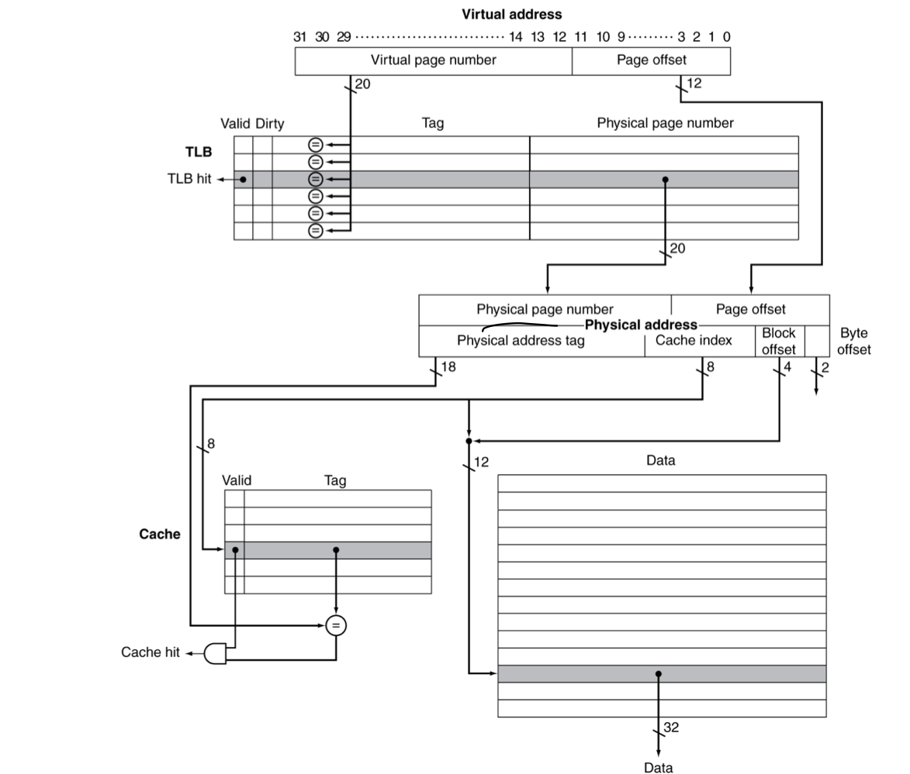

# 5.7. Virtual Memory
이제 캐시(SRAM)이 아닌, 메인메모리(DRAM)을 캐시처럼 사용하는 것에 대해 다룰 것임

## 1. Virtual Memory 개념
* 메인 메모리를 storage의 캐시로써 활용
    * Storage에서 많이 사용하는 것을 메인메모리에 올려 사용
    * CPU(HW)와 OS(SW)가 공동으로 관리함

* 프로그램들은 메인메모리를 공유하여 사용함
    * 각 프로그램들은 private한 virtual address space를 갖게되며, 자주 사용하는 code와 data를 여기에 두고 사용
    * 이 private한 영역들은 다른 프로그램으로부터 보호됨

* CPU와 OS는 가상 주소(Virtual Address)들을 물리 주소(Physical Address)로 번역함
    * Physical Memory의 Block 개념은 Virtual Memory에서 "**Page**"라고 불림
    * Miss는 Virtual Memory에서 "**Page Fault**"라고 불림

## 2. Address Translation
* 각각의 virtual address는 translation을 통해 physical address와 mapping이 됨
    * 하나의 Page는 하나의 Physical Address에 대응됨
* 메인메모리에 mapping이 되는 것도 있지만, storage에 mapping이 되는 것도 있음

### Example

* Fixed size pages (4KB pages, 전통적으로 4KB)
    * 그림의 예시는 2^12 = 4096 = 4KB의 Page size를 가짐
        * Page offset의 크기가 12비트인 것을 통해, 4KB의 Page size라는 것을 알 수 있음
            * 2^12 = 4096 = 4KB
    * Virtual memory (0~31, 총 32비트)는 2^32 = 4 * 2^30 = 4GB
        * Page offset인 12비트를 제외하면, **20비트** => **Virtual Page Number**
    * Physical memory (0~29, 총 30비트)는 2^30 = 1GB
        * Page offset인 12비트를 제외하면, **18비트** => **Physical Frame Number**
    * 4GB인 Virtual address 공간이 1GB인 Physical address 공간으로 번역되어야 함
        * 즉, 2^20인 Virtual Page Number을 2^18인 Physical Frame Number로 번역해야 함

## 3. Virtual Addressing with a Cache
* **CPU에서 사용하는 Virtual address 와 Cache에서 사용하는 Physical address 사이에 Translation 과정이 필요**
    * CPU(프로그램)가 사용하는 주소는 Virtual address
    * Cache가 사용하는 주소는 Physical address
* VA(Virtual Address) to PA(Physical Address)의 **번역 과정에, 추가적인 메모리 접근이 필요**
    * Translation 정보가 메인메모리에 존재하므로, 메인메모리 접근이 필요
    * 그러나, 메인메모리 Access time은 Cache에 비해 훨씬 느림 => Overhead 발생
* 따라서, **TLB(Translation Lookaside Buffer)의 HW를 사용**하여 이 문제를 해결함

### TLB(Translation Lookaside Bugffer)란?
가상 주소를 물리 주소로 번역할 때  
매번 메인메모리의 Page Table을 탐색하지 않도록,  
최근에 주소 번역에 사용한 주소 mapping 정보를 보관하는 캐시  

## 4. Page Fault Penalty
* RECAP - Page fault란?: 접근하고자 하는 Page가 메인메모리에 없는 것 (Cache에서의 Miss 개념)

* Page fault가 일어나면 page는 반드시 Disk(Storage)로부터 읽어와야(Fetch) 됨
    * 굉장한 시간이 소요됨
* Page fault rate (Page fault 발생률)을 **최소화하는 방안 2가지**
    * Fully Associative Placement 기법
        * 즉, 전체 Page Table의 translation 정보를 가져와서 갖고 있는 것
    * Smart Replace Algorithms
        * 즉, OS에서 정교한 알고리즘 사용

## 5. Page Tables
* Page Table은 Placement(Translation) 정보를 갖고 있음
    * **PTE(Page Table Entry)들이 배열로** 되어 있음
    * **Virtual Page Number로 색인화(Index) 되어 있음**
    * CPU의 **Page Table 레지스터가 Physical Memory에 있는 Page Table을 가리킴**

* **Page가 메인메모리에 있다면 (valid == 1)**,
    * PTE(Page Table Entry)가 **Physical Frame Number을 갖고 있음**
    * 그 외 다른 **상태 정보들도 비트로 가짐** (referenced, dirty, ...)
    * valid가 1이라면 메인메모리를 가리킴
    
* **Page가 메인메모리에 없다면 (valid == 0)**,
    * PTE(Page Table Entry)는 **Disk에 있는 Swap Space의 정보를 가리키게 됨**
    * valid가 0이라면 disk의 swap space 정보를 가리킴
    

## 6. Replacement and Writes
* Page fault rate를 줄이기 위해 LRU (Least Recently Used) 알고리즘이 선호됨
    * Page에 접근할 때, PTE(Page Table Entry) 내부 reference bit (aka. use bit)를 1로 설정
    * OS는 주기적으로 reference bit(use bit)를 0으로 초기화
    * 즉, page reference bit가 0이라는 것은 최근에 사용되지 않았다는 것을 의미

* Disk write는 많은 cycle이 소요됨
    * write는 block 단위로 한번에 이루어짐 (개별 byte로 write하지 않음)
    * 캐시와 메모리를 함께 업데이트하는 Write-through 방식은 비효율적
    * 즉, **Write-back 방식을 사용함**
    * Page가 업데이트 된 것을 알기 위해 PTE에 dirty bit를 두고 표시함

## 7. Fast Translation Using TLB
* 원래라면 주소 변환(address translation)은 추가적인 메모리 참조를 필요로 함(Page Table은 메모리에 위치)
    * TLB라 불리는 PTE(Page Table Entry)를 위한 빠른 cache를 CPU에 두고 사용함
    * Miss는 HW와 SW에 의해 처리됨
### 7.1. TLB Misses
* **Case 1: 만약 page가 메모리에 있다면,**
    * Page Table로부터 PTE를 받아서 다시 시도
    * HW에서 처리할 수도 있음
        * 그러려면 Page Table 구조와 HW 구조가 더 복잡해짐
    * SW에서 처리한다면, 
        * 특별한 Exception을 발생시키고, 최적화된 Handler로 처리함 (TLB Miss Handler)
* **Case 2: 만약 page가 메모리에 없다면 (page fault),**
    * OS가 처리하며, disk로부터 page를 fetch하고 Page Table을 업데이트
        * Step 1: Page Fault 감지 (Valid Bit가 0임을 확인)
        * Step 2: OS가 Page Fault를 처리 (Page Fault Handler)
        * Step 3: Page Table 업데이트
            ~~~
            디스크에서 해당 page를 RAM으로 로드
            Valid Bit를 1로 설정
            PTE에 새로운 PFN(Page Frame Number)를 저장
            ~~~
        * Step 4: TLB 업데이트 및 프로세스 재시작
    * 이후, page fault가 발생했던 instruction을 재실행
        * 새로운 translation 정보를 TLB에 캐싱

### 7.2. TLB Miss Handler
* TLB Miss가 발생하면, 메모리에서 Translation 정보를 찾을 수 있는지 여부에 따라 2 가지 경우로 나뉨
    * Case 1: page는 메인메모리에 존재하지만(Valid Bit == 1), PTE가 TLB 내에 존재하지 않음
    * Case 2: page가 메인메모리에 존재하지 않음(Valid Bit == 0)
* 대상 레지스터에 overwrite가 일어나기 전에 TLB miss임을 알아차려야 함 => Exception 발생
* Handler는 **Page Table에서 PTE를 찾아 TLB에 추가**(복사)
    * 그리고는 instruction 재실행
    * 만약 page가 실제로 없다면(Case 2), page fault 발생 => Page Fault Handler를 통해 처리

### 7.3. Page Fault Handler
* **Step 1: Page Fault 감지**
    * 프로세스가 Virtual Address에 접근하려고 했는데, 해당 페이지가 Page Table에 없음
    * 즉, Valid Bit == 0이라 메모리에 없는 상태
    * CPU는 Page Fault Exception을 발생시켜 OS에 제어권 넘김

* **Step 2: 디스크(Swap Space)에서 페이지 찾기**
    * OS는 disk의 Swap Space에서 해당 페이지를 찾음
    * 만약 해당 page가 존재하지 않으면, 프로세스가 잘못된 메모리 접근한 것
        * Segmentation Fault 발생

* **Step 3: 교체할 Page 선택 (Page Replacement)**
    * 만약 메모리에 빈 공간이 없다면, 기존 페이지중 하나를 내보내고(Swap Out) 새로운 페이지를 로드(Swap In)해야 함
    * 이때, 교체할 페이지를 결정하는 알고리즘이 필요(e.g., LRU)
    * Dirty Bit는 해당 page가 수정되었는지 나타냄
        * Dirty Bit == 0: 수정되지 않음, 바로 overwrite 가능
        * Dirty Bit == 1: 수정됨, 기존 내용을 disk에 먼저 저장한 후 overwrite

* **Step 4: 새 페이지를 메모리로 가져와 Page Table 업데이트**
    * 선택된 page를 메모리에 load한 후, Page Table을 업데이트
    * Page Table에서:
        * 해당 Virtual Address를 새롭게 할당된 Physical Address에 매핑
        * Valid Bit는 1로 설정
        * 새로운 PFN (Physical Frame Number) 저장

* **Step 5: 실패한 명령어 재실행**
    * 이전에 Page Fault가 발생했지만, 이번에는 Page Table이 올바르게 설정되어 정상 실행됨

### 7.4. TLB - Cache Interaction
  
* **PIPT**: 이전에 배운대로 **Physical Address를 Cache Tag로 사용**한다면?
    * **CPU는** 메모리를 접근할 때 **가상 주소(Virtual Address, VA)를 사용**
    * 하지만 cache는 **물리적 메모리 주소(Physical Address, PA)를 기반으로 작동**하는 경우가 많음
    * 그렇다면, **VA => PA 변환이 필요하며, TLB를 거쳐야 cache 탐색(lookup) 가능**
    * 즉, cache lookup 전에 TLB에서 주소 변환이 먼저 필요함 => Bottleneck 성능 저하로 이어짐
* **VIVT**: 다른 방식으로, **Virtual Address를 Cache Tag로 사용**하면?
    * VA를 그대로 Cache Tag로 사용하면 **TLB 변환 없이 곧바로 cache lookup 가능**
    * 즉, TLB가 Critical path 바깥에 있을 수 있음 => 더 빨라짐
    * 하지만 **Aliasing(동일한 PA를 여러 VA가 가리키는) 문제**가 존재
* **VIPT**: **Virtually Indexed, Physically Tagged** 기법
    * VIPT(Virtually Indexed, Physically Tagged): 위의 Aliasing 문제를 해결하는 기법 중 하나
    * Virtually Indexed: **가상 주소의 일부를 cache index로 사용**해 빠르게 접근 가능
    * Physically Tagged: **실제 PA를 기반으로 cache tag를 저장**해 일관성을 유지
    * 즉, **VA를 사용하여 빠르게 접근하고, 물리 주소를 확인해 같은 데이터가 여러 번 캐싱되는 것(Aliasing)을 방지**
#### 정리하자면,
| 기법 | 장점 | 단점 |
|------|------|------|
| **Physically Indexed, Physically Tagged (PIPT)** | 일관성 보장됨 | TLB 변환이 필요해 느림 |
| **Virtually Indexed, Virtually Tagged (VIVT)** | TLB 없이 캐시 접근 가능해 빠름 | Aliasing 문제 발생 |
| **Virtually Indexed, Physically Tagged (VIPT)** | 빠르면서도 일관성 유지 가능 | 인덱스 설계 신경 써야 함 |
**즉, VIPT 방식이 빠르면서도 일관성 유지가 가능하므로 많이 쓰인다!**

## 8. Memory Protection
* 각 **프로세스는 각자 다른 고유의 Virtual Address Space를 사용**함
    * 하지만 특정 경우, 같은 영역 일부 공유할 수 있음
    * 다른 프로세스가 잘못 접근하면 보호할 필요가 있음 
        * => OS의 도움으로 보호
* HW는 OS Protection을 지원함
    * Kernel Mode / User Mode 
        * => Kernel Mode는 모든 메모리 및 IO 장치 접근 가능
    * Privileged Instructions(특권 명령들) 
        * => Kernel Mode에서만 실행 가능 (e.g., load/store 명령으로 Page Table 수정)
    * Page Table과 기타 정보들은 오직 Kernel Mode에서 접근 가능 
        * => Page Table은 OS가 관리
    * System Call Exception
        * 사용자 프로세스가 Privileged Instruction(특권 명령)을 실행하려 하면, Exception 발생
* OS의 **Context Switch 시** 중요 변화: **Page Table 변경 및 TLB Flush**
    1. 새로운 프로세스의 Page Table 로드
        * 각 프로세스는 고유한 가상 주소 공간(Virtual Address Space)을 가지므로, 전환 시 Page Table을 새로 설정
    2. TLB Flush 필요
        * TLB는 최근의 가상 주소 => 물리 주소 매핑을 저장하는 cache 역할
        * 하지만 새로운 프로세스로 전환하면 기존 프로세스의 주소 매핑이 더 이상 유효하지 않음
        * TLB를 비우고(Flush) 새 프로세스의 새로운 페이지 매핑을 저장해야 함
    3. Adding task identifiers (태스크 식별자 추가)
        * Task ID를 추가하여 프로세스별로 캐시된 주소 변환을 구분 가능
        * 불필요한 TLB Flush를 줄일 수 있음