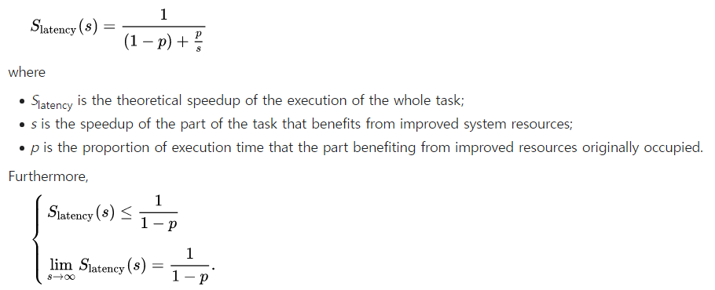

## Performance 심층 문제 
### 1. A program has 500 million instructions in total and consists of 200 million integer (INT) instructions and 300 million floating-point (FP) instructions. The program takes 0.5 seconds to execute on a 2 GHz processor. Assume all instructions take the same amount of time to execute.

위의 문제에서 주어진 정보를 정리하면,  
* 총 Instruction 수: `500 million` (`5 x 10^8`)
* INT Instruction 수: `200 million` (`2 x 10^8`)
* FP Instruction 수: `300 million` (`3 x 10^8`)
* CPU Time: `0.5 s`
* CPU Clock Rate: `2GHz` (`2 x 10^9` cycles/sec)
* 모든 Instruction이 같은 시간이 걸린다고 가정

#### 1.1. What is the IPC of the CPU for this program?
✅ **IPC 계산**:  
~~~
IPC (Instructions Per Cycles) = `Total Instructions` / `Total Cycles`
~~~
✅ **CPU Clock Cycles 계산**:  
~~~
CPU Time 
    = `CPU Clock Cycles` x `Clock Cycle Time` 
    = `CPU Clock Cycles` / `Clock Rate`

CPU Clock Cycles 
    = `CPU Time` x `Clock Rate`
~~~

* Total Cycles (= CPU Clock Cycles)
    * = `CPU Time` x `Clock Rate`
    * = `0.5 sec` x `2 x 10^9 cycles/sec`
    * = `1 x 10^9` cycles
* IPC의 계산식에 `Total Instructions`, `Total Cycles`를 대입하여 계산하면
    * = `5 x 10^8 instructions` / `10^9 cycles`
    * = `0.5` 

🎯 따라서, IPC = 0.5  
* 핵심 Point: 
    * 이 문제에서는 Clock Cycle Time 대신 Clock Rate가 주어진 점을 이용하여, CPU Clock Cycles를 구하고,
    * 이를 IPC 계산에 이용하는 것이 핵심

#### 1.2. The FPU of the CPU is improved to execute FP instructions 2x faster. What is the overall speedup of this new CPU?
✅ **암달의 법칙에 따른 Speedup 공식**:  

* p: 전체 실행 시간 중 개선되는 부분의 비율
* s: 그 부분이 개선되는 배수 (개선되는 부분이 몇배 빨라졌는가?)

1️⃣ **Step 1. FP Instruction의 비율 구하기** (공식에서 `p` 변수)  
* 총 Instruction 수: `5 x 10^8`
* FP Instruction 수: `3 x 10^8`
* FP Instruction의 비율은 `3` / `5` = `0.6`, 
    * 개선되는 부분(p)은 전체의 60%를 차지함

2️⃣ **Step 2. 암달의 법칙 공식 적용**  
* `s = 2`, `p = 0.6`을 공식에 대입하여 계산하면,
* Speedup = 1 / (`(1-0.6)` + `(0.6 / 2)`) = 1 / (0.4 + 0.3) = 1.43

🎯 따라서, Overall Speedup = 1.32  
* 핵심 Point:
    * 암달의 법칙 Speedup 계산 공식을 암기해두는 것이 핵심

-----

### 2. Parallelizing an application gives a practical speedup as the number of cores is increased, but the realistic speedup is bounded by two limitations: the percentage of the application that can be parallelized and the cost of communication.

#### 2.1. What is the speedup with N processors compared to a single processor if 90% of the application is parallelizable, ignoring the cost of communication?

#### 2.2. What is the speedup with 16 processors compared to a single processor if 80% of the application is parallelizable and, for every time the number of processors is doubled, the communication overhead is increased by 0.5% of the original execution time?
