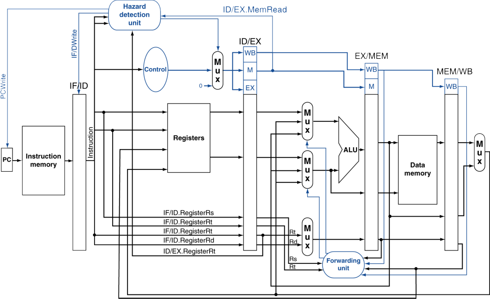
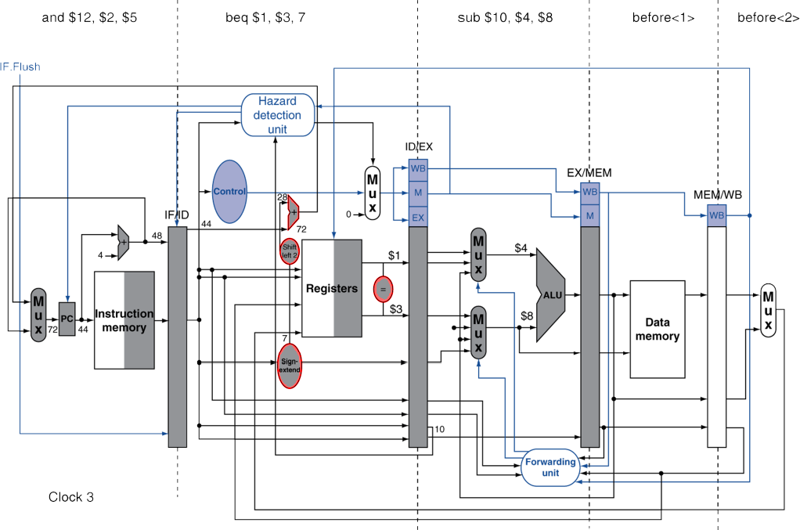

# 면접 기출 예시
* 외부에서 수집한 자료, 본인이 임의로 만든 개념적인 질문을 포함함
* 대학원 면접을 대비하기 위한 자료임
* **서울대 컴퓨터공학부**는 2가지의 과목을 선택하여 면접을 보도록 되어있으며, 그림과 함께 심층적으로 묻는 문제가 출제되는 것으로 알고 있음 [심층 문제로 이동](https://github.com/gjlee0802/computer-architecture/blob/main/interview_questions/4-the-processor.md#pipeline-hazards-%EC%8B%AC%EC%B8%B5-%EB%AC%B8%EC%A0%9C)
* **카이스트 전산학부**는 컴퓨터 구조 뿐만 아니라 모든 과목에서 전반적인 범위에 걸쳐 질문을 하며, 개념 질문들, 핵심 개념을 위주로 출제되는 것으로 알고 있음 [개념 질문으로 이동](https://github.com/gjlee0802/computer-architecture/blob/main/interview_questions/4-the-processor.md#%EA%B0%9C%EB%85%90-%EC%A7%88%EB%AC%B8)

## 개념 질문
### ISA (Instruction set architecture)
* CISC와 RISC의 차이점은 무엇인가?
* Register File과 Cache의 차이는 무엇인가?
* Intel과 AMD가 만드는 CPU의 공통점과 차이점은 무엇인가?
### Pipelined Architecture
#### 1. 파이프라이닝은 왜 하는가?
~~~
Instruction들을 병렬적으로 처리하여 속도를 향상시키기 위함

병렬처리로 성능 향상을 기대하는 것임 만약 모든 단계(stage)가 거의 같은 시간이 걸리고, 할 일이 충분히 많다면, 
파이프라이닝에 의한 속도 향상은 파이프라이닝 단계 수(stage 수)와 같음
~~~
#### 2. 파이프라인 해저드(Pipeline Hazard)란 무엇인가? 그리고 종류에는 무엇이 있는가?
~~~
다음 Instruction이 다음 Clock Cycle에 실행될 수 없는 상황
즉, 매 Cycle마다 Instruction을 실행해야 하는데, 그렇지 못하는 경우
~~~
- Structure Hazards (Structural)
    - **정의**: 서로 다른 명령어들이 하드웨어 리소스를 동시에 사용하려고 할 때 구조적으로 생기는 문제
    - **예시**: 예를 들어 Load/Store 명령어가 메모리에 접근하는 동시에 Instruction Fetch를 하려 하는 다른 Instruction가 있어, 동시적으로 하드웨어에 접근하여 발생하는 지연 문제가 있음
    - **해결**: Instruction Memory와 Data Memory를 구조적으로 분리시켜야 하거나, Instruction과 Data Cache를 분리해야 함
- Data Hazards
    - **정의**: 사용하려는 데이터가 준비되지 않아 데이터 의존성으로 인해 지연이 발생하는 문제
    - **예시**: 바로 직전 Instruction의 연산 결과가 레지스터에 쓰이지 않는 Read After Write 문제 같은 경우가 발생할 수 있음
    - **해결**: 위의 예시 같은 경우는 **Forwarding**으로 해결하며, Forwarding으로 해결되지 않는 예시로는 메모리에서 데이터를 읽어야 값을 가져올 수 있어서 값이 존재하지 않는 예가 있는데, 이러한 경우 **Code Scheduling**을 통한 Stall 방지를 고려할 수 있음
- Control Hazards
    - **정의**: 분기로 인해 Instruction flow가 바뀜으로 인해 지연이 발생하는 문제
    - **예시**: 예를 들어 beq 같은 조건부 분기(branch)가 있다고 할 때, 바로 다음 Instruction을 처리하기 위해 수행 중일 수 있는데, branch로 인해 다른 Instruction 수행을 해야할 수 있음
    - **해결**: Branch Prediction을 도입하여 간단한 방법으로는 항상 틀린 것(아닌 것으로)으로 예측(가정)할 수 있으며(다음 Instruction이 수행될 것으로 예측), 다른 현실적인 방법으로는 Hisory 테이블을 활용하여 이전의 branch 결과를 참고하여 예측하는 방법이 있음

#### 3. 파이프라이닝에서 Branch Prediction의 역할은 무엇인가?
~~~
Branch Prediction은 Control Hazards를 위한 분기 결과를 예측함으로써 지연을 줄이려는 방법으로, 
단순한 방법으로는 항상 분기 결과가 틀린 것(아닌 것)으로 가정하는 것이 있으며, 
현실적인 방법으로는 history table을 이용하여 이전의 분기들을 참고해서 예측하는 Dynamic Branch Prediction이 있음
~~~

#### 4. Branch Prediction에서 단순히 아닌 것으로 가정하는 방법을 사용했을 때의 문제점은? (굳이 Dynamic Branch Prediction을 사용하는 이유)
~~~
초대형(Stage가 아주 많은) Pipeline일수록, branch 패널티(stall)은 중요해짐(커짐)
이런 경우를 대비하여 Dynamic Branch Prediction을 활용하는 것이 적절함
~~~

## Pipeline Hazards 심층 문제
### 1. 5단계의 Pipeline에서 아래의 코드가 수행된다고 하자. (SSU 19년도 기출)
~~~
add $3, $1, $2      ...(1)
and $12, $5, $3     ...(2)
or  $13, $3, $6     ...(3)
sub $14, $3, $$2    ...(4)
sw  $15, 100($3)    ...(5)
~~~
#### 1.1. 위 코드 수행과정에서 발생하는 hazard를 설명하시오.
~~~
🎯 1번 명령어와 2번 명령어 사이에 $3으로 인한 Data hazard가 발생한다. 
(2)를 수행함에 있어서 EX 단계(ALU)에서 $3에 해당하는 값이 필요한데, 
add 명령어의 결과로 얻어지는 데이터이기 때문에 
RAW(Read After Write) 데이터 의존성으로 인해 hazard가 발생한다.
~~~
#### 1.2. 위에서 발생한 hazard를 Forwarding 방법만으로 해결하려고 한다. 가능한지 여부를 답하시오. (1) Yes라면, Forwarding 과정을 구체적으로 설명하시오. (2) No라면, 그 이유를 설명하고 추가적으로 해결하는 방법을 설명하시오.
~~~
🎯 Yes, Forwarding 방법만으로 해결할 수 있다.
~~~
* (2)번 명령어의 경우, 
    * `$3`이 **EX 단계에서 필요**하므로, (1)번 명령어가 MEM 단계에 있을 때 **EX/MEM 레지스터의 값을 포워딩**하여 해결함
* (3)번 명령어의 경우,
    * (1)번 명령어가 WB 단계에 있을 때 **MEM/WB 레지스터로부터 데이터를 포워딩**할 수 있음

#### 1.3. 위에서 발생한 hazard를 stall 방법(bubble 추가)만으로 해결하려 한다. 위 코드를 모두 수행하기 위해 bubble이 총 몇 개 필요한지 설명하시오.

~~~
🎯 2개 필요하다. 
(2)번 명령어가 ID 단계에서 $3의 값을 읽으려면,
(1)번 명령어의 WB 단계에서 쓰기가 끝난 후 읽어야하는데, 
2번의 Stall로 미뤄져야 가능하기 때문이다.
~~~

#### 1.4. 아래와 같이 (2)의 명령어가 `lw $2, 4($4)`로 바뀌었다고 하자. 이로 인해 새로 생긴 hazard를 설명하시오.
~~~
add $3, $1, $2      ...(1)
lw  $2, 4($4)       ...(2)
or  $13, $3, $6     ...(3)
sub $14, $3, $2     ...(4)
sw  $15, 100($3)    ...(5)
~~~
~~~
🎯 (2)와 (4) 사이에 Load-use hazard가 생긴다. 
(4)번 명령어는 $2의 값을 EX 단계에 피연산자로 사용해야 하는데, 
(4)번 명령어가 EX 단계에 들어섰을 때, 
(2)번 명령어는 WB 단계에 들어섰을 것이다.
따라서 (2)번 명령어는 WB 단계를 마치지 않아,
$2의 값을 얻을 수 없다.
~~~

#### 1.5. 새로 생긴 hazard를 Forwarding 방법 만으로 해결하려 한다. 가능한지 여부를 답하시오. (1) Yes라면, Forwarding 과정을 구체적으로 설명하시오. (2) No라면, 그 이유를 설명하고 추가로 해결하는 방법을 설명하시오
~~~
🎯 Yes, Forwarding 방법만으로 해결 가능하다.
이 문제는 RAW의 데이터 의존성에 의한 것이다.
(4)번 명령어가 EX 단계에 들어선 시점에,
(2)번 명령어는 MEM 단계를 수행하여 $2의 값을 메모리로부터 읽은 상태이다.
이때, $2의 값이 존재하는 상태이며, MEM/WB 레지스터에서 포워딩오면 해결이 가능하다.
~~~

* ✅ **이 문제에서 알 수 있는 Point**: Load-use hazard라고 해서 Forwarding으로 해결하지 못하는 것이 아님! 
    * Load-use hazard인데, 값이 존재하지 않는 경우가 Forwarding이 아닌, Code scheduling을 고려해야하는 것임

#### 1.6. 위에서 추가로 발생한 hazard를 stall 방법만으로 해력하려고 한다. bubble이 총 몇 개 필요한지 설명하시오.
~~~
🎯 bubble은 1개 필요하다. 
한번의 Stall이면 (4)번 명령에서 $2의 값이 필요한 시점(EX 단계)에,
(2)번 명령의 WB 단계를 마칠 수 있기 때문이다.
~~~

### 2. '그림 1'은 5단계 pipeline에서 data hazard를 해결하기 위해 forwarding unit과 hazard detection unit이 추가된 회로도이다. (SSU 17년도 기출)
  
그림 1. data hazard를 해결하기 위해 forwarding unit과 hazard detection unit이 추가된 회로도
#### 2.1. 아래 코드를 그림 1 회로에서 수행할 경우, 발생하는 모든 hazard에 대해 구체적으로 설명하시오.
~~~
add $5, $2, $1      ...(1)
lw  $3, 4($5)       ...(2)
lw  $2, 0($2)       ...(3)
or  $3, $5, $3      ...(4)
sw  $3, 0($5)       ...(5)
~~~
~~~
🎯 Hazard 1) 첫번째 Hazard로,
1번 명령어와 2번 명령어 사이에 $5 때문에 RAW Data Dependency로 인한 Data Hazard가 발생한다.
$5의 값이 2번 명령어의 EX stage에 피연산자로 필요한데,
1번 명령어의 $5의 값은 연산을 거쳐 EX stage를 마쳤을 때의 결과 값이므로 EX/MEM 레지스터로부터 Forwarding해서 가져와야 한다.
2번 명령어가 EX stage에 진입할 때, 1번 명령어는 MEM stage에 진입하므로 Forwarding이 가능하다.

🎯 Hazard 2) 두번째 Hazard로,
2번 명령어와 4번 명령어 사이에 $3 때문에 Load-Use Data Hazard가 발생한다.
$3의 값이 4번 명령어의 EX stage에 피연산자로 필요한데,
2번 명령어의 $3의 값은 메모리에서 읽은(load) 값이므로 MEM/WB 레지스터로부터 Forwarding해서 가져와야 한다. 
2번 명령어가 WB stage에 진입할 때, 4번 명령어는 EX stage에 진입하므로 Forwarding이 가능하다.

🎯 Hazard 3) 세번째 Hazard로,
4번 명령어와 5번 명령어 사이에 $3 때문에 RAW Data Dependency로 인한 Data Hazard가 발생한다.
RAW Hazard는 "이전 명령어에서 값을 계산하여 갱신하는데, 다음 명령어에서 이를 사용해야 할 때" 발생하는 것이다. 
즉, 4번 명령어에서 $3을 새롭게 할당하는데, 5번 명령어에서 $3을 저장하려고 하므로,
5번 명령어가 4번 명령어의 결과를 정확하게 반영하려면 forwarding (data forwarding)이나 stall이 필요하다.
~~~

#### 2.2. '그림 1'에서 forwarding unit은 있지만, 만일 hazard detection unit이 없다면 위 코드를 문제없이 실행할 수 있는지 여부를 Yes/No로 대답하고 그 이유를 구체적으로 설명하시오.
~~~
🎯 Yes, Forwarding Unit만으로 정상적으로 실행 가능하며, Hazard Detection Unit이 없어도 문제되지 않는다.

✅ Forwarding Unit은 EX 단계에서 발생한 연산 결과를 바로 다음 명령어에 전달하여 RAW (Read After Write) Hazard를 방지하는 역할을 한다.
✅ 하지만 Load-Use Hazard의 경우 Forwarding만으로는 해결되지 않고 Stall이 필요할 수 있다.
✅ 이 코드에서는 3번 명령어(lw $2, 0($2))가 자연스럽게 Stalling 역할을 수행하여, 추가적인 Stall 없이 Forwarding만으로 해결 가능하다.
~~~
| 조건 | Forwarding Unit만으로 실행 가능 여부 | 이유 |
|------|------------------------|------|
| **3번 명령어가 없는 경우** (2번 → 4번 바로 실행) | ❌ **Stalling이 필요함** | Forwarding만으로 해결되지 않으므로 Hazard Detection Unit이 필요 |
| **3번 명령어가 있는 경우** (2번 → 3번 → 4번 실행) | ✅ **문제없이 실행 가능** | 3번 명령어가 자연스럽게 Stalling 역할을 수행하여 Forwarding만으로 해결 가능 |

#### 2.3. '그림 1'에서 forwarding unit은 없고 hazard detection unit만 가지고 위 코드를 수행하려고 한다. hazard detection unit에 어떤 입력과 출력 신호가 새로 필요한지를 설명하시오. 왜 이런 신호들이 필요한지 예를 들어 설명하시오.
~~~
✅ Forwarding Unit에서는 EX stage에서 Hazard를 감지 했는데, Hazard Detection Unit에서 Hazard를 검출하기 위해서 ID stage에서 비교해야 하는 것이 핵심이다!!

✅ Forwarding Unit은 EX stage에서 ID/EX.registerRs, ID/EX.registerRt 피연산자 정보, 직전(1 Cycle 전) 명령어의 목적지 레지스터 EX/MEM.registerRd, 2 Cycle 전 명령어의 MEM/WB.registerRd 목적지 레지스터를 비교하여 Hazard 검출될 때 "Forwarding"을 하는 역할이다.

🎯 유사하게, Hazard Detection Unit의 경우에는 기존의 EX stage에서 검출하기 위해 사용한 정보 대신에, ID stage에서 IF/ID.registerRs, IF/ID.registerRt, ID/EX.registerRd, EX/MEM.registerRd 를 비교하여 Hazard를 검출한다.
그러나, Hazard Detection Unit만으로 Forwarding은 수행하지 않으며, Stall만 추가할 수 있다.
~~~

#### 2.4. 위 '2.3.' 문제의 회로를 갖고 위 코드를 전부 수행하려고 한다. 첫 사이클부터 종료될 때까지 사이클별로 Stalling을 포함하여 명령어 수행 순서를 정리하여 설명하시오. 
~~~
✅ Hazard Detection Unit만 있는데, Stalling만 가능하다.
각각의 Hazard에 대해 몇번의 bubble이 필요한지 생각해보면 된다.
위의 Hazard1을 해결하려면 2개의 bubble이 필요하다.
위의 Hazard2를 해결하려면 1개의 bubble이 필요하다.
위의 Hazard3를 해결하려면 2개의 bubble이 필요하다.

🎯 이를 감안하여 명령어 수행 순서를 정리하자면,
1번 명령어 수행
bubble (Hazard : 1 - 2)
bubble (Hazard : 1 - 2)
2번 명령어 수행
3번 명령어 수행
bubble (Hazard : 2 - 4)
4번 명령어 수행
bubble (Hazard : 4 - 5)
bubble (Hazard : 4 - 5)
5번 명령어 수행
~~~

### 3. 다음은 Control Hazard에 대한 질문이다. '그림 1'에서 아래 코드가 수행된다고 하자. 맨 앞의 숫자는 그 명령어가 저장된 주소이다. (SSU 17년도 기출)
  
그림 1. data hazard를 해결하기 위해 forwarding unit과 hazard detection unit이 추가된 회로도

~~~
30: beq $1,  $3,  5       ...(1)
34: or  $8,  $5,  $2      ...(2)
38: add $9,  $3,  $4      ...(3)
42: and $6,  $2,  $7      ...(4)
46: add $14, $2,  $2      ...(5)
...
54: sw  $2, 4($3)         ...(6)
~~~

#### 3.1. 30번지 beq 명령어에서 조건이 만족되어 branch 해야하는 상황을 그 명령어의 어느 수행단계에서 알게 되는가? 답을 쓰고 이유를 구체적으로 설명하시오. branch가 발생하는 경우 flushing해야 하는 명령어가 몇 개인지 위의 코드에서 구체적으로 밝히시오. Timing chart와 같은 그림을 그려서 발생하는 상황을 구체적으로 설명하시오.

~~~
✅ beq 조건부 명령어에서 $1과 $3이 같다는 것을 알게 되는 것은 EX stage이지만,
✅ 분기할 최종 주소를 계산하여 알게되는 것은 MEM stage이다.
✅ 이 MEM stage 다음 clock cycle에서 분기할 주소의 명령어를 가져온다.
분기할 최종 주소는 (30 + 4) + (5 * 4), 54번지인 6번 명령어이다.
🎯 아래의 Timing chart를 참고하면 3개의 명령어가 Flush되어 버려진다.
~~~
🎯 **Timing chart**:  
| PC        | CC1 | CC2 | CC3 | CC4 | CC5            | CC6 | CC7 | CC8 | CC9 |
|-----------|-----|-----|-----|-----|----------------|-----|-----|-----|-----|
| 30 (beq)  | IF  | ID  | EX  | MEM | WB             |     |     |     |     |
| 34 (or)   |     | IF  | ID  | EX  | ❌**Flushed** | -   |     |     |     |
| 38 (add)  |     |     | IF  | ID  | ❌**Flushed** | -   | -   |     |     |
| 42 (and)  |     |     |     | IF  | ❌**Flushed** | -   | -   | -   |     |
| **58 (sw)** |   |     |     |     | IF             | ID  | EX  | MEM | WB  |

**beq 명령어의 실행 과정을 정리하자면**,  
`beq $1, $3, offset` 명령어는 `$1`과 `$3`의 값이 같은 경우, `offset × 4` 바이트 만큼 이동하여 분기하는 명령어임
* EX (Execute) 단계에서:
    * 두 레지스터 값($1, $3)을 비교하여 조건이 만족하는지 결정함.
    * 즉, 분기 여부(branch taken or not taken)는 EX 단계에서 결정됨.
* MEM (Memory) 단계에서:
    * PC 값을 업데이트하고, 실제로 분기할 최종 주소를 결정.
    * 분기가 확정되면 파이프라인을 Flush하고, 새로운 명령어를 가져오기 시작.

#### 3.2. 아래 '그림 2'는 '그림 1'과 비교할 때 회로가 추가되었다. 어떤 부분에 어떤 기능이 추가됐는지와 이 회로가 추가된 목적을 설명하시오. (위에 쓰인 명령어는 무시)

그림 2. 변경된 회로도

~~~
✅ branch할 주소를 계산하는 요소(adder)를 ID stage에서 가능하도록 옮겼다.
✅ 주소가 같은지 비교하는 요소(comparator)를 ID stage에서 가능하도록 옮겼다.
✅ IF.flush Control Signal이 추가되었다.
✅ 즉, 변경하기 전인 '그림 1'에서는 '3.1.' 문제에서 봤듯이 분기 여부는 EX stage에서 수행되고, 분기할 최종 주소를 결정하는 것은 MEM Stage에서 수행된다.

🎯 '그림 2'에서는 주소 계산을 ID stage에서 가능하게 하여 branch할 주소를 미리 ID stage에서 결정하게 됨으로써 flush 개수를 줄일 수 있다. ID stage에서 branch할 주소가 결정되기 때문에 ID stage 다음 Clock Cycle에서 branch할 주소의 명령어가 수행된다.
🎯 즉, 이 회로가 추가된 목적은 flush 개수를 줄여 지연(delay)를 줄이기 위함이다.
~~~

#### 3.3. '그림 2' 회로에서 위의 코드를 수행한다고 할 때 수행과정을 Timing chart와 같은 표를 그려서 발생하는 상황을 구체적으로 설명하시오. branch가 발생하는 경우 Flushing 해야 하는 명령어가 몇 개인지 위의 코드에서 구체적으로 밝히시오.
🎯 아래의 Timing chart를 참고하면 1개의 명령어가 Flush되어 버려진다.  
🎯 **Timing chart**:  
| PC        | CC1 | CC2 | CC3           | CC4 | CC5 | CC6 | CC7 |
|-----------|-----|-----|---------------|-----|-----|-----|-----|
| 30 (beq)  | IF  | ID  | EX            | MEM | WB  |     |     |
| 34 (or)   |     | IF  | ❌**Flushed** | -   | -   | -   |     |
| 58 (sw)   |     |     | IF            | ID  | EX  | MEM  | WB |