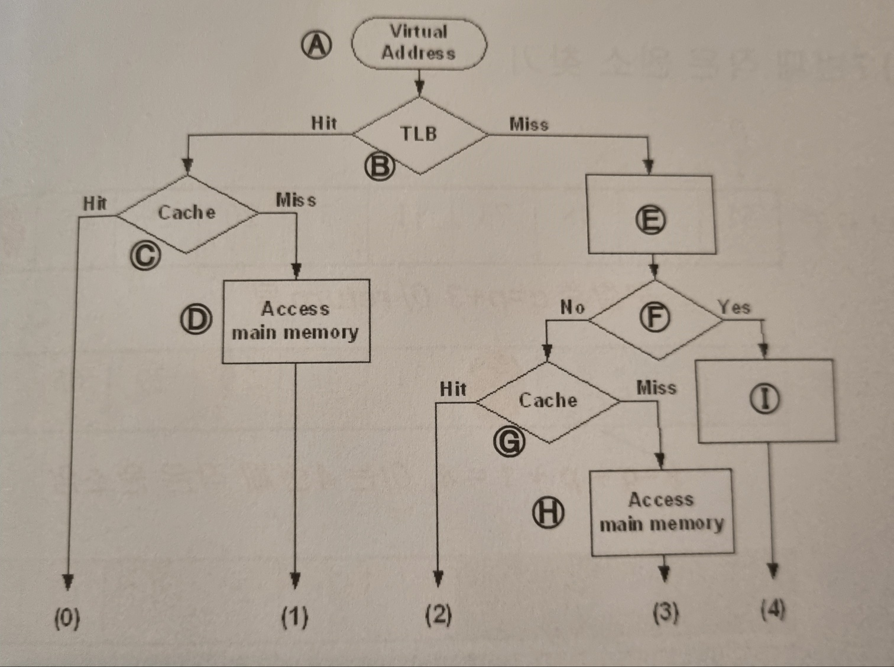
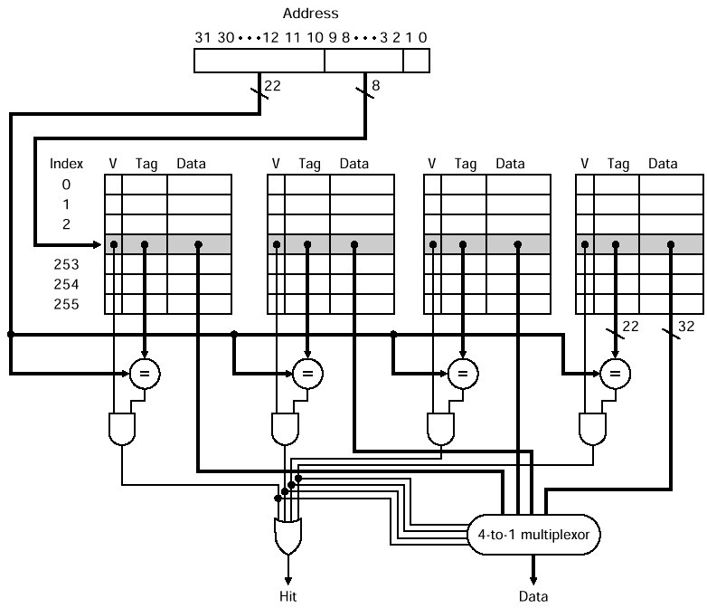

# 면접 기출 예시

## 개념 질문
### Memory Hierarchy
#### 1. 캐시가 필요한 이유는? Cache hit ratio 에 대해 설명하시오.
* 캐시가 필요한 이유: 
~~~
캐시는 데이터 접근 속도를 높이고, 시스템의 성능을 최적화하기 위해 사용
즉, 빠른 메모리에 자주 사용하는 데이터를 저장해서 성능을 높이자는 원칙
~~~
* Cache hit ratio란?:
~~~
Cache Hit Ratio(캐시 적중률)는 캐시에서 원하는 데이터를 찾을 확률을 나타내는 지표로, 전체 요청 중 캐시에서 성공적으로 제공된 요청의 비율을 의미함

Cache Hit Ratio = Cache Hits / (Cache Hits + Cache Misses)
~~~

#### 2. 메모리 접근하는데 x 사이클이 걸리고 캐시에 접근하는데 y 사이클이 걸리며 캐시 hit rate 가 h %일 때 effective access time은?
~~~
EAT (Effective Access Time)은 cache를 활용한 메모리 접근의 평균 소요 시간을 계산하는 값
~~~
~~~
Cache Hit rate와 Miss rate를 고려하여 다음과 같이 계산함:

EAT = (Hit Rate x Cache Access Time) + (Miss Rate x (Cache Access Time + Memory Access Time))-
    = Cache Access Time + Miss Rate x Memory Access Time
~~~
🎯 즉, `캐시 접근 시간 y`에 `Cache Miss 발생 시 추가로 걸리는 메모리 접근 시간`이 더해지는 형태!  

#### 3. Page Fault는 언제 발생하는가? Page Fault 비율과 Cache Miss 비율 중 큰 것은? 그 이유는?
**Page Fault는 언제 발생하는가?:**
~~~
🎯 Page Fault는 Page Table에서 해당 페이지의 Valid Bit이 0으로 설정되어 있어, 해당 페이지가 물리 메모리에 존재하지 않는 경우 발생함  
✅ 이때 운영체제(OS)는 디스크에서 해당 페이지를 가져와 메모리에 로드하는 과정(Page Swap-In)을 수행함  
~~~
**Page Fault 비율과 Cache Miss 비율 중 큰 것은? 그 이유는?:**
~~~
🎯 일반적으로 Cache Miss 비율이 Page Fault 비율보다 훨씬 큼  
✅ 이유: 캐시는 작은 용량에서 빠르게 동작하며 자주 교체되지만, 페이지는 운영체제가 효율적으로 관리하여 디스크 접근을 최소화하기 때문  
~~~

### Virtual Memory
#### 1. 캐시 메모리와 메인 메모리의 주소 지정 방식의 차이점이 무엇인가?
~~~
🎯 캐시는 CPU가 메모리에 접근할 때 Physical Address를 기반으로 접근하도록 함
    반면, 프로세스가 사용하는 메인 메모리는 Virtual Address를 기반으로 접근 (OS가 Virtual Address를 Physical Address로 매핑하여 메인메모리를 관리)
~~~
#### 2. TLB란 무엇인가?
~~~
TLB: Virtual Address를 Physical Address로 변환할 때 사용하는 Cache 장치로, 매번 메인메모리의 Page Table을 탐색하지 않아도 되도록 하기 위해 최근에 Translation에 사용한 주소 Mapping 정보를 보관함
~~~

## Cache Performance 관련 심층 문제
### 1. Level 1 Cache(Primary Cache)가 아래와 같은 Miss Rate로 동작한다고 하자. Miss rate = 0%인 Perfect cache가 있다고 가정할 때, 아래의 Cache 대비 성능 향상 Factor을 계산하시오. (SSU 17년도 기출)
**주어진 Cache의 변수:**
~~~
Instruction cache miss rate = 2%
Data cache miss rate = 4%
CPI = 1 without any memory stalls
Miss penalty = 100 cycles
Frequency of all loads and stores = 25%
~~~

**Actual CPI 계산:**
~~~
Base CPI = 1
I-Cache Miss Cycle = Instruction Cache Miss Rate x Miss Penalty = 0.02 x 100 = 2 Cycle
D-Cache Miss Cycle = Data Cache Miss Rate x 0.25 x Miss Penalty = 0.04 x 0.25 x 100 = 1 Cycle
Actual CPI = Base CPI + I-Cache Miss Cycle + D-Cache Miss Cycle = 1 + 2 + 1 = 4 Cycle
~~~
따라서 Perfect Cache는 위의 Cache 성능(Actual CPI)에 비해 4배의 성능 향상이 있음

### 2. Multilevel Cache 성능 비교이다. (SSU 17년도 기출)

**(a) 주어진 Level-1 Cache(Primary Cache)의 변수:**
~~~
Clock rate = 4 GHz
CPI = 1.0 with a primary cache of 100% hit rate
Main memory access time = 100 ns (including miss handling)
Miss rate/instruction at the primary cache = 2 %
~~~

**(b) 주어진 Level-2 Cache의 변수:**
~~~
Miss rate (to Main Memory) = 0.6 %
L2 cache access time = 5 ns
~~~

#### 2.1. Primary cache(L1 cache)만을 사용할 경우 Total CPI(Effective CPI)를 구하시오. 
🎯 `Total CPI` = `Base CPI` + `Miss CPI` = `Base CPI` + (`Miss Rate/Instruction` x `Miss Penalty`)  
✅ 여기서는 Miss Penalty를 계산하는 것이 중요 Point!  
✅ `L1 Cache Miss Penalty` = `Memory Access Time` / `Clock Cycle Time`  

✅ **풀이:**  
~~~
Base CPI = 1
Clock rate = 4GHz가 주어지면,  =>  1 Clock cycle 소요 시간 계산 떠올리기
1 Clock cycle time = 1 / Clock rate = 1 / 4GHz = 0.25 ns
L1 cache Miss penalty = Memory Access Time / Clock Cycle Time = 100 ns / 0.25 ns = 400 Clock cycles
~~~
🎯 따라서 Total CPI(Effective CPI)는 아래와 같이 계산됨
~~~
Total CPI = 1 + (0.02 x 400) = 1 + 8 = 9 Clock cycles
~~~

#### 2.2. L2 cache까지 사용할 경우 Total CPI(Effective CPI)를 구하시오.
🎯 `Total CPI` = `Base CPI` + `L1 Miss with L2 Hit CPI` + `L1 Miss with L2 Miss CPI`  
✅ 여기서는 L2 Cache에서 Hit일 때와 Miss일 경우의 L1 Miss CPI를 나누어 생각하는 것이 중요 Point!  
✅ Primary Stalls: `L1 Miss with L2 Hit CPI` = `Miss rate at the primary cache` x `L1 Miss with L2 Hit Penalty`  
✅ Secondary Stalls: `L1 Miss with L2 Miss CPI` = `L2 Miss rate (to Main Memory)` x `L1 Miss with L2 Miss Penalty`  

✅ **풀이:**  
~~~
1 Clock cycle time = 1 / Clock rate = 1 / 4GHz = 0.25 ns

(1). L1 Miss with L2 Hit Penalty 계산하기 (L2 Access에 대한 Penalty 계산)
L1 Miss with L2 Hit Penalty = L2 cache access time / Clock cycle time
    = 5 / 0.25 = 20 Clock cycles

(2). L1 Miss with L2 Miss Penalty 계산하기 (Main Memory Access에 대한 Penalty 계산)
L1 Miss with L2 Miss Penalty = Memory access time / Clock cycle time
    = 100 / 0.25 = 400 Clock cycles
~~~
🎯 따라서 Total CPI(Effective CPI)는 아래와 같이 계산됨  
~~~
Total CPI = Base CPI + Primary Stalls + Secondary Stalls
    = 1 + (2% x 20) + (0.6% x 400) = 3.8 Clock cycles
~~~

#### 2.3. L2 cache까지 사용할 경우, L1 cache만을 사용할 경우 대비 성능 향상 Factor을 계산하시오.
🎯 Primary cache만을 사용할 경우에는 Total CPI가 9, L-2 cache까지 사용할 경우 Total CPI가 3.8이었으므로, 2.36배의 성능 향상을 보임  
~~~
9 / 3.8 = 2.36
~~~

### 3. TLB, Cache, Virtual Memory를 통합하여 사용한다고 하자. 그림은 CPU가 Virtual Address로 Memory Access를 요청했을 경우 처리되는 경우들을 나누어 보여준다. (SSU 19년도 기출)
  

#### 3.1. (E), (F), (I)의 Box 안 내용은 각각 무엇인가?
~~~
* (E): Lookup Page Table
* (F): Page Fault
* (I): Page Fault Exception => Page Fault Handler
~~~

#### 3.2. 실제 Physical Address로 Translation이 이루어지는 구간들은 어디인가? (예시: A와 B 사이 구간)
🎯 Cache에 접근하게 되는 구간에서 Virtual Address => Physical Address의 Translation이 이루어짐  
~~~
* B와 C 사이 구간
* F와 G 사이 구간
~~~
#### 3.3. TLB Access Time = 10ns, Cache Access Time = 20ns, Main Memory Access Time = 100ns라고 하자.

**3.3.1. 그림 하단의 (0) ~ (3) 각각에 대해 메모리 접근 시간을 계산하시오.**
~~~
* (0): 10 + 20 = 30 ns
* (1): 10 + 20 + 100 = 130 ns
* (2): 10 + 100 + 20 = 130 ns
* (3): 10 + 100 + 20 + 100 = 230 ns
~~~

**3.3.2. TLB Hit Rate = 99%, Cache Hit Rate = 80%라고 하자. 그림 하단의 (4)는 발생하지 않는다고 가정한다. CPU의 평균 메모리 접근시간을 위 3.3.1. 문제의 결과들을 이용하여 계산하시오. 메모리 참조 전체를 1로 간주할 때, (0) ~ (3) 각각이 차지하는 비율이 얼마인지를 먼저 계산하시오.**

**(0) ~ (3) 각각이 차지하는 비율 계산:** 
~~~
* (0): TLB Hit Rate x Cache Hit Rate = 0.99 x 0.8 = 0.79
* (1): TLB Hit Rate x Cache Miss Rate x 1 = 0.99 x 0.2 = 0.19
* (2): TLB Miss Rate x 1 x Cache Hit Rate = 0.01 x 0.8 = 0.008
* (3): TLB Miss Rate x 1 x Cache Miss Rate x 1 = 0.01 x 0.2 = 0.002
~~~

평균 메모리 접근 시간 계산:
~~~
(0)이 차지하는 비율 x (0)의 메모리 접근 시간 + (1)이 차지하는 비율 x (1)의 메모리 접근 시간 + (2)이 차지하는 비율 x (2)의 메모리 접근 시간 + (3)이 차지하는 비율 x (3)의 메모리 접근 시간

= (0.79 x 30) + (0.19 x 130) + (0.008 x 130) + (0.002 x 230) = 51 ns
~~~

## Cache Associative 관련 심층 문제
### 1. 그림은 4 way set associative 방식 cache memory 구조를 보여준다. 각 data 크기는 4 byte이다. (SSU 18년도 기출)
  
#### 1.1. 그림에서 맨위 Address가 주어졌을 때, cache hit인지 판단하는 과정, hit일 경우 최종 data를 읽어내는 과정을 설명하시오.
* Step 1. 주소 분해 (Address Breakdown)
    * 주어진 32-bit 주소에서:
        * Tag (22-bit): 상위 22비트
        * Index (8-bit): 중간 8비트 (256개의 index)
        * Offset (2-bit): 하위 2비트 (4-byte 데이터)

* Step 2. Index로 Cache 조회
    * Index 필드를 사용하여 해당 Index의 4개(4-way) 캐시 블록을 모두 조회
        * Index 하나당 4개의 캐시 블록이 조회됨

* Step 3. Tag 비교 및 유효성 체크
    * 각 way에서 저장된 tag와 입력 tag를 비교하고, Valid Bit가 1인지 확인
    * 일치하는 tag가 있고, 동시에 Valid Bit가 1이면 Cache Hit

* Step 4. Multiplexer을 통한 데이터 선택
    * Hit이 발생한 way의 데이터를 4-to-1 멀티플렉서를 사용하여 선택함
    * 선택된 4 byte 데이터를 출력함

* Step 5. Hit 신호 출력

#### 1.2. data 부분의 cache memory의 총 크기는? (byte 단위로 표기할 것)
~~~
4 x 256 x 4 = 4096 bytes
~~~
#### 1.3. data 부분의 cache memory의 총 크기는 위의 1.2.와 동일하고, 16 way set associative 방식으로 변경되어 운영한다고 하자. 맨 위에 주어진 실제 메모리 주소는 tag, index, block 내부 offset(B) (또는 block 내부 offset(W) 및 Word 내부 byte offset)으로 나뉜다. 각각 몇 bit인가?
**Step 1. Index의 크기(bits) 계산을 위해 Set의 개수 구하기**:
~~~
16 way set associative 방식은 한 Set 당 블록의 개수가 16개라는 의미

Data 부분의 총 크기 = 4096 bytes
Block(= Data 1개)의 크기 = 4 bytes

블록(aka. Cache Entry)의 개수 = 4096 / 4 = 1024 개

Set의 개수 = 블록(= Cache Entry) 개수 / Way 수
    = 1024 / 16 = 64개
~~~
**Step 2. Tag, Index, Block 내 Offset의 크기 계산하기**:
~~~
Index 크기 계산: 
2^6 = 64 (= Set의 개수)이므로, Index는 모든 Set의 개수를 포함할 수 있는 6 bits로 이루어짐

Byte 내 Offset 크기 계산: 
Byte Offset은 Block의 크기가 4 bytes이므로 2 bits로 이루어짐

Tag 크기 계산: 
Tag는 전체 32 bits에서 Index, Bytes Offset 부분을 제외한 24 bits로 이루어짐
~~~

#### 1.4. CAM 또는 Associative Memory 중 어느 것에 해당되는가? CAM의 정의도 함께 설명하시오.
